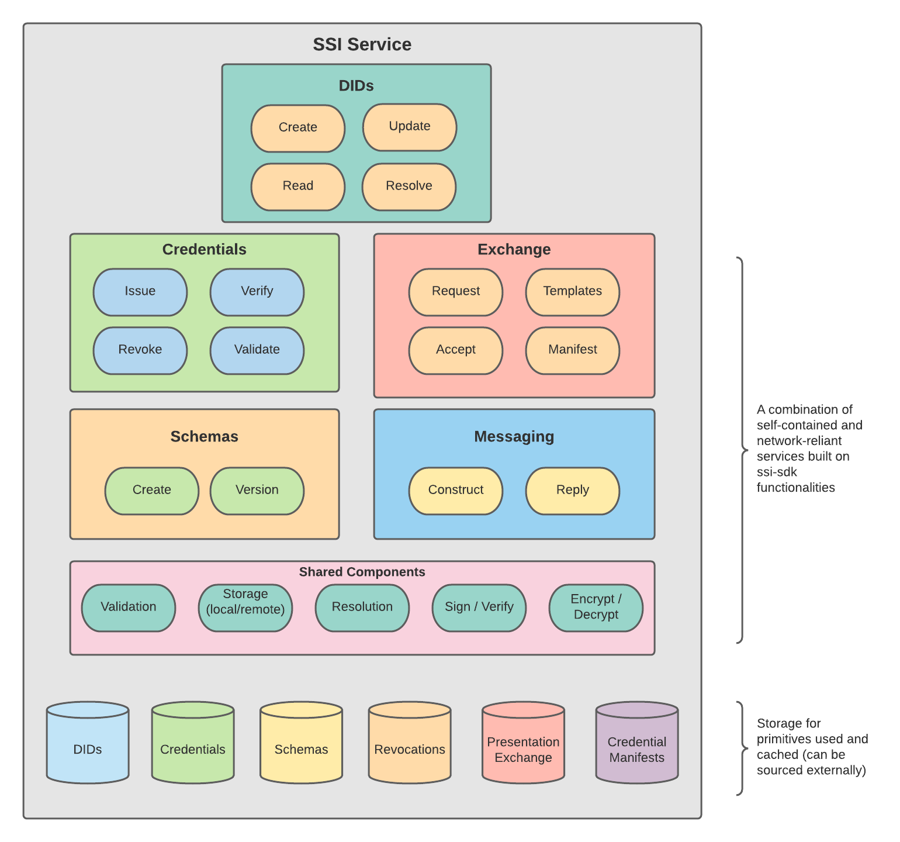

[](https://pkg.go.dev/github.com/TBD54566975/ssi-service)
[](https://golang.org/)
[](https://github.com/TBD54566975/ssi-service/blob/main/LICENSE)
[](https://github.com/TBD54566975/ssi-service/issues)


# ssi-service

## Introduction

The Self Sovereign Identity Service (SSIS) facilitates all things relating to [DIDs](https://www.w3.org/TR/did-core/)
and [Verifiable Credentials](https://www.w3.org/TR/vc-data-model) -- in a box! The service is a part of a larger 
Decentralized Web Platform architecture which you can learn more about in our 
[collaboration repo](https://github.com/TBD54566975/collaboration). The SSI Service is a RESTful web service that
wraps the [ssi-sdk](https://github.com/TBD54566975/ssi-sdk). The core functionality of the SSIS includes, 
but is not limited to: interacting with the standards around Verifiable Credentials, Credential Revocations, requesting
Credentials, exchanging Credentials, data schemas for Credentials and other verifiable data, messaging using 
Decentralized Web Nodes, and usage of Decentralized Identifiers. Using these core standards, the SSIS enables robust
functionality to facilitate all verifiable interactions such as creating, signing, issuing, curating, requesting, 
revoking, exchanging, validating, verifying credentials in varying degrees of complexity.



## Continuous Integration

CI is managed via [GitHub Actions](https://github.com/TBD54566975/ssi-service/actions). Actions are triggered to run
for each Pull Request, and on merge to `main`. You can run CI locally using a tool like [act](https://github.com/nektos/act).

## Deployment

The service is packaged as a [Docker container](https://www.docker.com/), runnable in a wide variety of
environments. [Docker Compose](https://docs.docker.com/compose/) is used for simplification and orchestration. To run
the service, you can use the following command, which will start the service on port `8080`:

```shell
mage run
```

Or, you can run docker-compose yourself:

```shell
cd build && docker-compose up 
```

You should then be able to send requests as follows:
```shell
 ~ curl localhost:8080/health
{"status":"OK"}
```

## What's Supported?

- [x] [DID Management](https://www.w3.org/TR/did-core/)
  - Using [did:key](https://w3c-ccg.github.io/did-method-key/)
- [ ] [Verifiable Credential Schema](https://w3c-ccg.github.io/vc-json-schemas/v2/index.html) Management
- [x] [Verifiable Credential](https://www.w3.org/TR/vc-data-model) Issuance & Verification
- [ ] Requesting, Receiving, and the Validation of Verifiable Claims using [Presentation Exchange](https://identity.foundation/presentation-exchange/)
- [ ] Applying for Verifiable Credentials using [Credential Manifest](https://identity.foundation/credential-manifest/)
- [ ] Revocations of Verifiable Credentials using the [Status List 2021](https://w3c-ccg.github.io/vc-status-list-2021/)
- [ ] [ID Hub](https://identity.foundation/identity-hub/spec/) Messaging

## Design Thinking

The design of the service, at present, assumes it will be run by a single entity. Additional work is needed
around authentication and authorization schemes to access the service and its functionalities, possible User Interfaces
to use the service, and much more! Please [open a discussion](https://github.com/TBD54566975/collaboration/discussions)
if you are interested in helping shape the future of this project.

## Contributing

This project is fully open source, and we welcome contributions! For more information please see
[CONTRIBUTING](CONTRIBUTING.md). Our current thinking about the development of the library is captured in
[GitHub Issues](https://github.com/TBD54566975/ssi-service/issues).

## Project Resources

| Resource                                   | Description                                                                   |
|--------------------------------------------|-------------------------------------------------------------------------------|
| [CODEOWNERS](./CODEOWNERS)                 | Outlines the project lead(s)                                                  |
| [CODE_OF_CONDUCT.md](./CODE_OF_CONDUCT.md) | Expected behavior for project contributors, promoting a welcoming environment |
| [CONTRIBUTING.md](./CONTRIBUTING.md)       | Developer guide to build, test, run, access CI, chat, discuss, file issues    |
| [GOVERNANCE.md](./GOVERNANCE.md)           | Project governance                                                            |
| [LICENSE](./LICENSE)                       | Apache License, Version 2.0                                                   |
