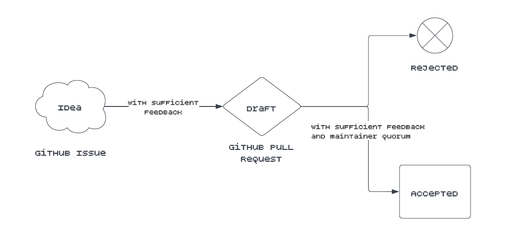

# SSI Improvement Proposal

# What is a SIP?

All feature proposal documents for the SSI Service follow a common format and are known as SSI Improvement Proposals or
SIPs. Features must list a DRI (Directly Responsible Individual) and follow the [template here](sips/sip_template.md).
Discussion is encouraged on GitHub issues and pull requests.

## SIP Status

Features each have a status which can be one of the following, inspired by
the [BIP process](https://github.com/bitcoin/bips/blob/master/bip-0002.mediawiki):

- **Idea** – An idea that is not quite a draft and exists as a GitHub issue. Needs feedback and discussion.
- **Draft** – A formal proposal for a feature addition, submitted as a Pull Request against a new *SIP directory*.
  Requires feedback, discussion, and approval from a quorum of maintainers before acceptance.
- **Rejected** – A terminal state for a proposal. Possible reasons include deciding to go in a different direction,
  not a good fit, or the proposal being withdrawn or cancelled by the submitter.
- **Accepted** – A terminal state for a proposal. Proposals that are accepted may begin to be developed against.

## Taking a SIP

When your idea is ready for a draft clone this repository, create a new SIP following
the [template](sips/sip_template.md), add it to the table below, and open up a pull request.

# SIPs

| SIP                          | Description                                       | DRI                                              | Status   | Date of Status     |
| ---------------------------- | ------------------------------------------------- | ------------------------------------------------ | -------- | ------------------ |
| [SIP-1](sips/sip1/README.md) | SIP Purpose and Guidelines                        | [Gabe Cohen](https://github.com/decentralgabe)   | Accepted | August 24, 2022    |
| [SIP-2](sips/sip2/README.md) | Credential Issuance Flow                          | [Neal Roessler](https://github.com/nitro-neal)   | Accepted | September 13, 2022 |
| [SIP-3](sips/sip3/README.md) | Key Access: Signing & Verification                | [Gabe Cohen](https://github.com/decentralgabe)   | Accepted | September 20, 2022 |
| [SIP-4](sips/sip4/README.md) | DWN Message Processing / Credential Issuance      | [Neal Roessler](https://github.com/nitro-neal)   | Accepted | September 23, 2022 |
| [SIP-5](sips/sip5/README.md) | Credential Application Processing                 | [Gabe Cohen](https://github.com/decentralgabe)   | Accepted | November 3, 2022   |
| [SIP-6](sips/sip6/README.md) | Presentation Exchange And Long Running Operations | [Andres Uribe](https://github.com/andresuribe87) | Accepted | November 8, 2022   |
| [SIP-7](sips/sip7/README.md) | Credential Revocation                             | [Neal Roessler](https://github.com/nitro-neal)   | Accepted | November 7, 2022   |
| [SIP-8](sips/sip8/README.md) | Webhooks for External Services                    | [Neal Roessler](https://github.com/nitro-neal)   | Accepted | December 8, 2022   |
| [SIP-9](sips/sip9/README.md) | External Signing                                  | [Andres Uribe](https://github.com/andresuribe87) | Draft    | May 17, 2023       |
