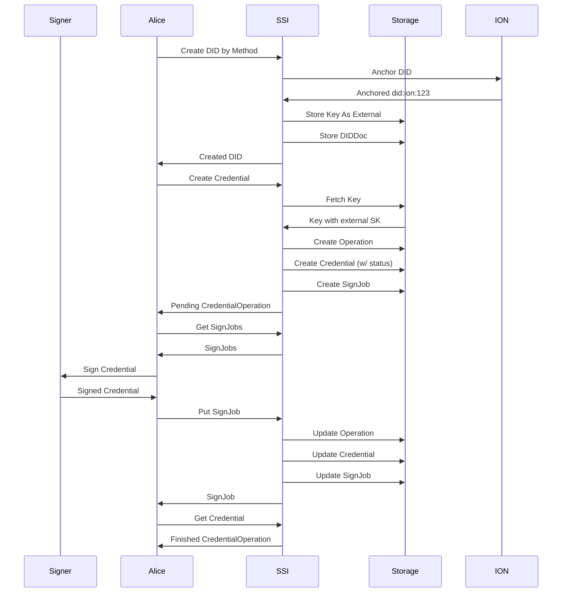

# SIP 9 - External Signing

# SIP 9: External Signing

```yaml
SIP: 9
Title: External Signing
Author(s): Andres Uribe
Status: Draft
Created: May 10, 2022
Updated: May 17, 2022
```

# Abstract

This proposal specifies how SSI will support users bringing their own signing mechanism, typically through a KMS.

## Background

A KMS (Key Management System) is software that securely generates, stores, and manages encryption keys used to protect sensitive data. It ensures key security and enables centralized management.

A KMS can be used to sign messages. For example, with a Hardware Security Module (HSM), the process involves generating a key pair, creating a hash of the message, signing the hash with the private key stored securely in the HSM, and verifying the signature using the corresponding public key. This ensures message authenticity and integrity. For example, a sender can use an HSM to generate a digital signature for a message, and the recipient can verify the signature using the public key associated with the HSM-stored private key.

Popular online KMS systems include widely adopted cloud-based solutions such as AWS Key Management Service (AWS KMS), Google Cloud Key Management Service (Google Cloud KMS), and Microsoft Azure Key Vault. These services provide scalable and secure key management capabilities, allowing organizations to centrally manage encryption keys and integrate them into various applications and services.

On the other hand, a hardware wallet is a physical device designed to securely store private keys and facilitate cryptocurrency transactions. While a hardware wallet is not the same as an HSM, there is a relationship between them. Hardware wallets often incorporate HSM technology as a means of protecting the private keys stored within the device. HSMs provide robust security features and tamper-resistant hardware, making them an ideal choice for securing cryptographic keys in hardware wallets. This combination ensures the secure storage and management of private keys, enhancing the overall security of cryptocurrency transactions and mitigating the risk of key compromise.

Supporting an external KMS in a software system is crucial for enhanced security, centralized key management, interoperability, portability, and compliance auditing.

## Goals

Describe how we will support signing payloads with an external KMS that holds keys which SSI Service doesn’t have access to. That KMS can be offline, like an HSM.

## Contents

---

# Specification

Below is a sequence diagram explaining how the flow would work for an issuer that is looking to have their keys be outside ssi-service.



The updates needed in SSI Service are listed below.

- Updating the [Create DID Document](https://developer.tbd.website/docs/apis/ssi-service/#tag/DecentralizedIdentityAPI/paths/~1v1~1dids~1%7Bmethod%7D/put) endpoint so callers can communicate that they want to create a non-custodial DID document.
- Storing keys in the DB that point to external key material.
- Change the response type of the [Create Credential](https://developer.tbd.website/docs/apis/ssi-service/#tag/CredentialAPI/paths/~1v1~1credentials/put) endpoint to return an `Operation` object. This object communicates that SSI Service needs to receive a signed credential payload in order for the credential to be fully issued.
- Change the response type of the [Create Presentation Request](https://developer.tbd.website/docs/apis/ssi-service/#tag/PresentationDefinitions) endpoint to return an `Operation` object similar to the point above.
- Do that for manifest and for schema.
    - Note that the concept of Credential Application that can be *Reviewed* already exists in our API. This proposed design would be a step before Review is possible.
- The `GET` endpoint `v1/signjobs`that returns all pending `SignJob` objects for a given DID.
- The `PUT` endpoint `v1/signjobs` that receives a signed payload that was encoded in the sign job.
- Create documentation on how to set this up.
- (Optional) handle key rotation.

---

# Considerations

## Alternatives

External signing can also be achieved by having a highly available online KMS, similar to what GCP KMS and AWS KMS offer. A different design could leverage a tighter integration that has SSI Service making requests to the online KMS to sign payloads. Access to the online KMS would be need to be configured and gated by the callers of the API, prior to creating the associated DID.

Pros of the current design

- Works for self-custodial HSMs.
- No need to store any access tokens, or potentially sensitive information.

Cons

- More integration work for the operator.
- Many APIs change by making them Async (i.e. they return `Operation` objects).

## Tradeoffs

We are only allowing clients of SSI to specify whether all or none of the keys in the DIDs they create can be custodial. We are doing this because it is easier to reason about all/none keys in your DID document being managed, versus keeping track of which ones are and aren’t.

One thing  to note is that there are many signed objects that we store. If we’re supporting external signing, then key rotation involves invalidating the existing signatures and validating them again. This has the implication of all stored objects having a corresponding status, effectively making all credentials revokable.

Finally, this is introducing a X-cutting state machine on top of ones that we already have implemented (e.g. the Credential Application). Supporting this feature is likely to increase the code complexity.

## Failure Modes & Mitigations

Signing may be badly done, so care needs to be taken to ensure that verification is done whenever a SignJob is uploaded.

After a SignJob is updated to contain the signed payload, it should be immutable. Further modification should not be allowed.

- Consider doing a separate endpoint that has immutable objects.

## Dependencies

None.

## Future Work

Supporting key rotation properly.

## Security & Privacy

This is encouraging more secure usage of ssi service, where you don’t trust the service to handle keys. There is no impact on privacy.