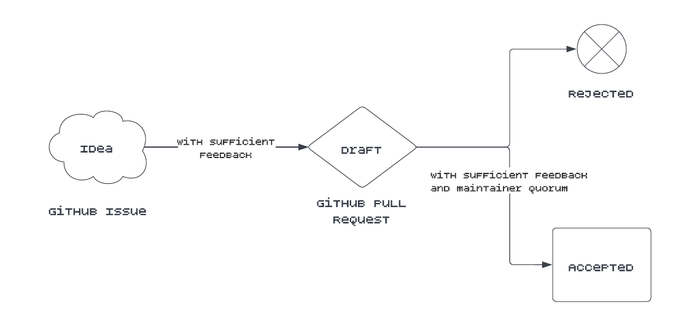

# SSI Improvement Proposal

# What is a SIP?

All feature proposal documents for the SSI Service follow a common format and are known as SSI Improvement Proposals or
SIPs. Features must list a DRI (Directly Responsible Individual) and follow the [template here](sips/sip_template.md).
Discussion is encouraged on GitHub issues and pull requests and optionally on our forums.

## SIP Status

Features each have a status which can be one of the following, inspired by
the [BIP process](https://github.com/bitcoin/bips/blob/master/bip-0002.mediawiki):

- **Idea** – An idea that is not quite a draft and exists as a GitHub issue. Needs feedback and discussion.
- **Draft** – A formal proposal for a feature addition, submitted as a Pull Request against a new *SIP directory*.
  Requires feedback, discussion, and approval from a quorum of maintainers before acceptance.
- **Rejected** – A terminal state for a proposal. Possible reasons include deciding to go in a different direction,
  not a good fit, or the proposal being withdrawn or cancelled by the submitter.
- **Accepted** – A terminal state for a proposal. Proposals that are accepted may begin to be developed against.

## Taking a SIP

When your idea is ready for a draft clone this repository, create a new SIP following
the [template](sips/sip_template.md), add it to the table below, and open up a pull request.

# SIPs

| SIP   | Description                | DRI                                            | Status   | Date of Status  |
|-------|----------------------------|------------------------------------------------|----------|-----------------|
| SIP-1 | SIP Purpose and Guidelines | [Gabe Cohen](https://github.com/decentralgabe) | Accepted | August 24, 2022 |
|       |                            |                                                |          |                 |

