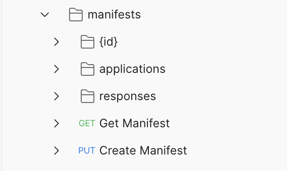
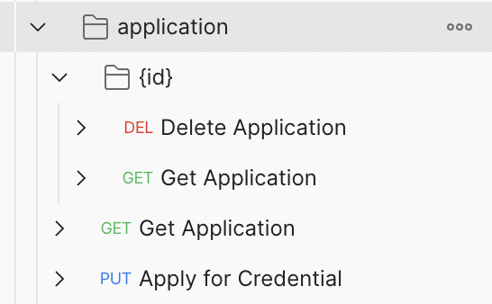
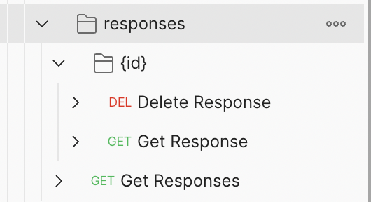
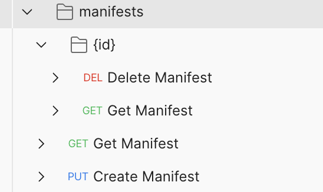

# SIP 2 Credential Issuance Flow


```yaml
SIP: 2

Title: Credential Issuance Flow

Author(s): Neal Roessler, Gabe Cohen

Comments URI: https://forums.tbd.website/t/sip-2-discussion-credential-issuance-flow/125

Status**: Accepted

Created: August 23, 2022

Updated: September 12, 2022
```

# Abstract

The process described here is the full flow and interaction of Credential Manifests, Credential Applications, and Credential Responses in context of how the ssi service will handle these entities. The user will fill out a Credential Application against an existing Credential Manifest and then receive a Credential Response object. This can be accomplished in a synchronous or asynchronous form.

## Background

*What prior information outside of this spec is useful or necessary to understand this proposal?*

Credential Manifest Spec is a required pre-read: [https://identity.foundation/credential-manifest/](https://identity.foundation/credential-manifest/)

High level definitions of objects are here:

The *[Credential Manifest](https://identity.foundation/credential-manifest/#term:credential-manifest)* is a common data format for describing the inputs a Subject must provide to an Issuer for subsequent evaluation and issuance of the credential or credentials indicated in the Credential Manifest. There must be a formal process to create and receive a credential manifest.

*[Credential Applications](https://identity.foundation/credential-manifest/#term:credential-application)* are JSON objects embedded within target claim negotiation formats that pass information from the *[Holder](https://identity.foundation/credential-manifest/#term:holder)* to the *[Issuer](https://identity.foundation/credential-manifest/#term:issuer)*.

[Credential Responses](https://identity.foundation/credential-manifest/#term:credential-fulfillments) are objects embedded within target [Claim](https://identity.foundation/credential-manifest/#term:claim) negotiation formats that express how the outputs presented as proofs to a [Holder](https://identity.foundation/credential-manifest/#term:holder) are provided in accordance with the outputs specified in a [Credential Manifest](https://identity.foundation/credential-manifest/#term:credential-manifest).

*What are the pre-requisites that need to be true for this work to succeed?*

The Credential Manifest, Credential Application and Credential Response objects in the SSI-SDK must be compliant to the spec and must be able to be fully accessible by the SSI Service.

## Goals

*What is the purpose of this SIP? In bullet form, what are the goals and non-goals for this work?*

- Create and verify a new Credential Manifest, Credential Application, and Credential Response objects with required and optional fields and store it in a datastore
- Get all existing Credential Manifest, Credential Application, and Credential Response objects and be able to request one in particular by id
- Delete existing Credential Manifest, Credential Application, and Credential Response objects
- Be able to Apply to a specific Credential Manifest by using a Credential Application and then receive a valid Credential Response
- Validation of all aspects
    - Correct JSON
    - Correct JSON to object conversion with required fields
    - Corresponding manifest ids and descriptor maps exist and line up according to the spec

---

# Specification

*Main area for going into your proposal, technical details with diagrams as necessary. It is ok to list multiple possible options, and outline your recommendation.*

### High level outline

**Credential Manifests:** Straightforward crud actions

**Credential Responses** - Get and delete but no create (created response are created from the “Apply For Credential” route in application)

**Credential Application** - There is no crud creation of an application, only an Apply for Credential route. The input will be a Credential Application json object and the output will be a Credential Response object or a processing message. After doing a PUT to this route, it will save the Credential Application and Credential Response (if created) in the database. Also, if this is asynchronous and the Response can not happen immediately the output would give you a Credential Response Id and the status: processing. You could keep polling the GET response/{id} and when it gets fulfilled it will return the Credential Response object.

The high level route structure will be under manifests:

`{{baseUrl}}/v1/manifests/...`



### **Credential Applications** API **Routes**



- PUT `{{baseUrl}}/v1/manifests/applications`
    - Apply for credentials by submitting a Credential Application that are has linkings to a Credential Manifest. This function will return a response object that could contain the Response Request, or a response request ID that one can later query to receive.
        - **Input -** Will be a Credential Application
            - The object **MUST** contain an `id` property.
            - The object **MUST** contain a `spec_version` property.
            - The object **MUST** contain a `manifest_id` property.
            - The **MUST** have a `format`property if the related [Credential Manifest](https://identity.foundation/credential-manifest/#term:credential-manifest) specifies a `format`property
            - The [Credential Application](https://identity.foundation/credential-manifest/#term:credential-application) object **MUST** contain a `presentation_submission` property IF the related [Credential Manifest](https://identity.foundation/credential-manifest/#term:credential-manifest) contains a `presentation_definition`
        
```jsx
{
  "application": {
      "@context": [
          "https://identity.foundation/credential-manifest/"
      ],
      "id": "868edb2f-2251-4575-a9e4-6009a8a903fa",
            "spec_version": "https://identity.foundation/credential-manifest/spec/v1.0.0/",
            "manifest_id": "25a42469-395a-4230-961d-e65c164d8e41",
            "format": {
              "ldp_vc": {
                "proof_type": [
                  "JsonWebSignature2020",
                    "EcdsaSecp256k1Signature2019"
                ]
              }
            },
      "presentation_submission": [
                "id": "a30e3b91-fb77-4d22-95fa-871689c322e2",
            "definition_id": "32f54163-7166-48f1-93d8-ff217bdb0653",
            "descriptor_map": [
              {
                "id": "input_1",
                "format": "jwt_vc",
                "path": "$.verifiableCredential[0]"
              }
          ]
      ]
  }
}
```
        
        - **Response** - Will give response object with status error, pending, or success
        
```jsx
{
    "status" : "success"
    "id": "534eacd0-5f0a-469d-82ef-d0f64e098c45",
    "response": {
        ...
        ...
   }
}
```
        
```jsx
{
    "status" : "pending"
    "id": "534eacd0-5f0a-469d-82ef-d0f64e098c45"
}
```
        
```jsx
{
    "status" : "error"
    "reason" : "No manifests id exists for application request"
}
```
        
    - GET `{{baseUrl}}/v1/manifests/applications`
        - Returns a list of all applications
        - Optional issuer parameter will return a list of all manifests created by a particular subject
    - GET `{{baseUrl}}/v1/manifests/applications/:id`
        - Returns an application by id. If there is nothing to return an error will be returned
    - DEL `{{baseUrl}}/v1/manifests/applications/:id`
        - Deletes a application by the id provided
        

### **Credential** Responses **API** R**outes**



- Credential Responses are objects embedded within target [Claim](https://identity.foundation/credential-manifest/#term:claim) negotiation formats that express how the outputs presented as proofs to a [Holder](https://identity.foundation/credential-manifest/#term:holder) are provided in accordance with the outputs specified in a [Credential Manifest](https://identity.foundation/credential-manifest/#term:credential-manifest)
    - The object **MUST** contain an `id` property.
    - The object **MUST** contain a `spec_version` property, and its value **MUST** be a valid spec URI according to the rules set in the [versioning section](https://identity.foundation/credential-manifest/#versioning).
    - The object **MUST** contain a `manifest_id` property. The value of this property **MUST** be the `id` value of a valid [Credential Manifest](https://identity.foundation/credential-manifest/#term:credential-manifest).
    
```jsx
    {
      "response": {
              "id": "a30e3b91-fb77-4d22-95fa-871689c322e2",
              "spec_version": "https://identity.foundation/credential-manifest/spec/v1.0.0/",
              "manifest_id": "32f54163-7166-48f1-93d8-ff217bdb0653",
              "application_id": "b6385066-147c-49d0-9783-261a2154b1fd",
              "descriptor_map": [
                {
                  "id": "banking_output_2",
                  "format": "jwt_vc",
                  "path": "$.verifiableCredential[0]"
                }
              ]
        }
    }
```
    
- GET `{{baseUrl}}/v1/manifests/responses`
    - Returns a list of all responses
    - Optional issuer parameter will return a list of all responses fulfilled by a particular issuer
    - Optional issuer parameter will return a list of all responses fulfilled by a particular subject
- GET `{{baseUrl}}/v1/manifests/responses/:id`
    - Returns a responses by id. If there is nothing to return an error will be returned
- DEL `{{baseUrl}}/v1/manifests/responses/:id`
    - Deletes a responses by the id provided

### **Credential Manifests** API **Routes**



- Create, Read and Delete Manifests
    - Creates a manifest and verifies that it has at least the minimum requirements
        - *Credential Manifests* are JSON objects composed as follows:
        - The object **MUST** contain an `id` property
        - The object **MUST** contain an `issuer` property
        - The object **MUST** contain an `output_descriptors` property
        - The object **MAY** include a `format` property
        - The object **MAY** contain a `presentation_definition` object
        
```jsx
        {
          "manifest": {
              "@context": [
                  "https://identity.foundation/credential-manifest/"
              ],
              "id": "868edb2f-2251-4575-a9e4-6009a8a903fa",
              "issuer": "did:ion:issuer",
              "output_descriptors": [
                {
                  "id": "driver_license_output",
                  "schema": "https://schema.org/EducationalOccupationalCredential",
                }
              ]
          }
        }
```

        
    - PUT `{{baseUrl}}/v1/manifests`
    - GET `{{baseUrl}}/v1/manifests`
        - Returns a list of all manifests
        - Optional issuer parameter will return a list of all manifests created by a particular issuer
    - GET `{{baseUrl}}/v1/manifests/:id`
        - Returns a manifest by id. If there is nothing to return an error will be returned
    - DEL `{{baseUrl}}/v1/manifests/:id`
        - Deletes a manifest by the id provided

---

# Considerations

## Tradeoffs

*What is lost with this approach? What is gained?*

This approach keeps it simple and consistent with the other objects in the SSI Service. The base minimum create read and delete operations are in place and a user can go through a full flow of receiving a Credential Response

## Failure Modes & Mitigations

*What can go wrong and why? How can it be mitigated?*

If an application was approved but the connection is disconnected a user can still receive the Credential Response by querying for existing Credential Responses. All steps can be done in an asynchronous way.

## Dependencies

*What dependencies exist between this and other pieces of work?* 

SSI-SDK implementing the Credential Manifest, Credential Application, and Credential Response objects to spec and validation between these objects

## Future Work

*What work comes next/what does this enable?*

Eventually there can be updating to existing objects and also adding or removing components such as dynamically changing the `output_descriptors `of an existing credential manifest

## Security & Privacy

*What security and/or privacy implications are relevant to the proposed change?*

Letting the user post an open ended manifest or applications could open up to attacks on the service. To mitigate we should have strong validity checks and check max length and validate every field. 

---

# Release

## Success Criteria

*How will this work be tested? How will we know it was successful?*

A full unit test and integration test suit will be implemented with this change along with example use case implementation

## Rollout

*How is this work rolled out? What is the timeline? What type of version bump would this change result in? Would it deprecate existing functionality?*

Rollout would be similar to how the other pieces of ssi service have been deployed by creating a pull request from a branch and merging it in after proper scrutiny 

---

# References

*Enumeration of content links used in this document*

The *Credential Manifest* is a common data format for describing the inputs a Subject must provide to an Issuer for subsequent evaluation and issuance of the credential or credentials indicated in the Credential Manifest. There must be a formal process to create and receive a credential manifest.

*Credential Applications* are JSON objects embedded within target claim negotiation formats that pass information from the [Holder](https://identity.foundation/credential-manifest/#term:holder) to the[Issuer](https://identity.foundation/credential-manifest/#term:issuer).

[Credential Fulfillments](https://identity.foundation/credential-manifest/#term:credential-fulfillments) (Responses) are objects embedded within target [Claim](https://identity.foundation/credential-manifest/#term:claim) negotiation formats that express how the outputs presented as proofs to a [Holder](https://identity.foundation/credential-manifest/#term:holder) are provided in accordance with the outputs specified in a [Credential Manifest](https://identity.foundation/credential-manifest/#term:credential-manifest).

*Credential Manifest in DIF* - [https://identity.foundation/credential-manifest/#credential-manifest](https://identity.foundation/credential-manifest/#credential-manifest)

*Credential Manifest in SSI-SDK* [https://github.com/TBD54566975/ssi-sdk/tree/main/credential/manifest](https://github.com/TBD54566975/ssi-sdk/tree/main/credential/manifest)