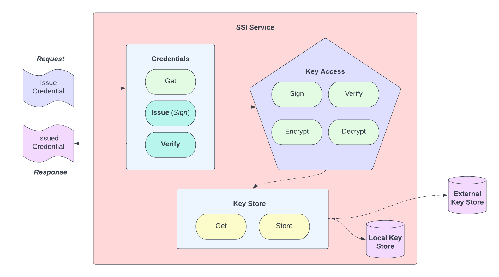

# SIP Template

```yaml
SIP: 3

Title: Key Access, Signing & Verification

Author(s): Gabe Cohen @decentralgabe

Comments URI: https://forums.tbd.website/t/sip-3-discussion-key-access-signing-verification/133

Status: Accepted

Created: September 12, 2022

Updated: September 14, 2022
```

# Abstract

Support key access operations such as signing and verification in a generic manner for a variety of objects (e.g. Verifiable Credentials, Credential Manifests, Presentation Requests, etc.) to be used in the SSI Service.

## Background

- [W3C Data Integrity](https://w3c.github.io/vc-data-integrity/)
- Signing suites utilizing _Data Integrity_, such as [VC JWS 2020](https://github.com/w3c/vc-jws-2020)
- [Verifiable Credentials Proofs](https://www.w3.org/TR/vc-data-model/#proofs-signatures)
- [Keystore Service PR](https://github.com/TBD54566975/ssi-service/pull/62)

## Goals

**Goals**
- Support a number of key types and algorithms, as exposd by the SSI SDK
- Allow integration for signing/verification into other SSI Service modules like `credentials`, in addition to having a standalone API for signing and verifying
	- Support Data Integrity suites, starting with VC JWS 2020
	- Support JW* signing/verification

**Non-goals**
- Encryption/decryption and other cryptographic operations besides signing and verification are not to be covered in this proposal
	- A follow up SIP can be used to handled encryption and other crypto ops as needed
- Support more than the SSI SDK currently exposes

---

# Specification

## Overview

_This design is focused on Signing & Verification._

The [SSI SDK](https://github.com/TBD54566975/ssi-sdk) defines a few utilities for signing and verification:
- Linked Data Proofs via [Cryptosuite](https://github.com/TBD54566975/ssi-sdk/blob/main/cryptosuite/cryptosuite.go)
- [JWT Signing and Verification](https://github.com/TBD54566975/ssi-sdk/blob/main/cryptosuite/jwt.go)

Broadly, we need to support both paths -- one using Linked Data Proofs and the other using JWTs. At this point in time the only Cryptosuite supported is [JSON Web Signature 2020](https://w3c.github.io/vc-jws-2020/). For both the JSON Web Signature 2020 suite and JWT signing the key material between the signing / verification methods is common, and can be represented using JSON Web Keys (JWKs).

The [Keystore Service PR](https://github.com/TBD54566975/ssi-service/pull/62) support any key type and relies on a method implemented per key type that enables serialization to base58 value of a private key. This design leverages key storage for keys to be used for signing/verification. The keys may be associated with a DID, and identified via key reference (e.g. `did:example:1234#key-1`)

## Design

Key operations are core to much of the functionality the SSI Service enables. Things like signing and verifying:
- Credentials
- Presentation Exchange objects
- Credential Manifest objects
- Revocation objects
- DID state operations
- many more!

Though the service may not always store the key material it needs to carry out these operations, it should have a common interface for performing them. The proposal only focused on a new piece of functionality called _KeyAccess_. KeyAccess encapsulates all operations one may do with a cryptographic key: sign/verify, encrypt/decrypt, commit/reveal, and so on. This proposal focuses specifically on signing and verification functionality, but lays the ground work for future key access operations.

### Configuration
The design proposes a _KeyAccess_ interface that exposes methods like _Sign_ and _Verify_ that optionally leverage a _KeyStore_ underneath. The _KeyStore_ itself is an interface, and though there is a local implementation, it is possible to implement a compliant remote KeyStore or even an implementation of a _KeyAccess_ provider that needs no separate _KeyStore_. With this configuration, here are the combinations of functionality we are able to support:


1. Local keystore, local key access
- _e.g. the keys are stored by a DB in the service and accessed directly for in-process signing/verification_

2. Remote keystore, local key access
- _e.g. the keys are stored in a DB external to the service, but can be fetched and provided to the service for in-process signing/verification_

3. Remote key access
- _e.g. an implementation of KeyAccess is provided which abstracts the location of key storage, providing remote signing/verificaiton, returning the result to the service_

It is possible to have a generic `KeyAccess API` that works for multiple objects like Credentials or Schemas, or to have purpose-specific KeyAccess APIs like `CredentialsKeyAccess` or `SchemasKeyAccess`. It's not immediately clear which is better, and some experimentation is necessary before committing to a direction.

### Usage

Key operations can be performed by adding a KeyAccess dependency on services which require it.

The diagram below illustrates the flow:



Notably, Key Access is not a new service, but a new set of APIs that _optionally depends on_ a _KeyStore_ and _is depended on_ by any service that requires Key Access.


### API

The API for the Key Access service is provided in-process for services in the SSI Service that rely on Key Access. At the time of writing, the service supports two pieces of functionality that would benefit from sign/verify logic: VC JSON Schemas and Credentials. Their existing service APIs will be updated to incorporate signing/verifying, and so will their APIs.

**Credentials**:

- Update `CreateCredentialRequest` to include a `SigningConfig` property as such:

```go
type SigningConfig struct {
	// Added with this SIP (e.g. did:example:abcd#key-1)
	KeyID string `json:"kid" validate:"required"`
	// Where the value is either "JWT" or an LD Signature Suite such as "JsonWebSignature2020"
	SignatureType string `json:"signatureType" validate:"required"`
}
```

```go
type CreateCredentialRequest struct {
	// (e.g. did:example:abcd)
	Issuer  string `json:"issuer" validate:"required"`
	// Added with this SIP (e.g. did:example:abcd#key-1)
	SigningConfig SigningConfig `json:"signingConfig" validate:"required"`
	Subject string `json:"subject" validate:"required"`
	Context string `json:"@context"`
	Schema string                 `json:"schema"`
	Data   map[string]interface{} `json:"data" validate:"required"`
	Expiry string                 `json:"expiry"`
}
```

- Add a new `VerifyCredential` endpoint which is a **PUT** to `/v1/credentials/verify`

Request body as follows:

```go
// must have one of the following fields
type VerifyCredentialRequest struct {
	// JSON representation of a credential
	Credential  *string `json:"credential"`

	// JWT representation of a credential
	JWT *string `json:"jwt"`
}
```

with a response as follows:

```go
type VerifyCredentialResponse struct {
	// binary verified or not
	VerificationResult bool `json:"verificationResult" validate:"required"`
	// optional explanation of verification result
	VerificationReason string `json:"verificationReason,omitempty`
}
```

_Note: this eliminates the possibility of creating a key without a signature._

**Similar updates will be made to all services that can utilize signing and verification. Examples omitted for brevity**.

### Other Ideas

**Key Store**

The API for storing a key, **PUT** to `/v1/keys`, takes in a `kid` property. Key access assumed that the `kid` is known and referencable by the requester of a key acess operation. If this assumption breaks it may be worth include a key-aliases property, and exposing the ability to update key aliases and query by them.

**Today**

```go
type StoreKeyRequest struct {
	ID               string         `json:"id" validate:"required"`
	Type             crypto.KeyType `json:"type,omitempty" validate:"required"`
	Controller       string         `json:"controller,omitempty" validate:"required"`
	Base58PrivateKey string         `json:"base58PrivateKey,omitempty" validate:"required"`
}
```

**Tomorrow?**

Adding aliases increases querying complexity. It is also possible that multiple aliases could conflict.

```go
type StoreKeyRequest struct {
	ID               string         `json:"id" validate:"required"`
	Alises			 []string       `json:"aliases,omitempty"`
	Type             crypto.KeyType `json:"type,omitempty" validate:"required"`
	Controller       string         `json:"controller,omitempty" validate:"required"`
	Base58PrivateKey string         `json:"base58PrivateKey,omitempty" validate:"required"`
}
```

### Considered Option: External API

_Note, I do notn plan on implementing this to begin with but include it here for consideration._

We add on to the existing `/v1/keys` endpoint, which currently contains:

- **PUT** `/v1/keys` -- stores a key
- **GET** `/v1/keys/:id` -- get details of a key based on its identifier, which is generated by the service upon storage

New APIs:

1. Sign an object

**Endpoint**: *PUT* `/v1/keys/sign` 
**Request Body**:

```go
type SignRequest struct {
	Data string `json:"data" validate:"required"`
	SigningConfig `json:"signingConfig" validate:"required"`
}
```

**Response**:

```go
type SignResponse struct {
	SignedData string `json:"data"`
}
```

2. Verify an object

**Endpoint**: *PUT* `/v1/keys/verify`

**Request Body**:

```go
// Must have a piece of JSON data or a JWT to verify and specify a key ID
type VerifyRequest struct {
	Data *string `json:"data,omitempty"`
	JWT *string `json:"jwt,omitempty"`
	VerificationKey `json:"keyId" validate:"required"`
}
```

This endpoint relies on keys the service already knows about. A future enhancement could work with externally referenced keys.

**Response**:

```go
type VerifyResponse struct {
	// binary verified or not
	VerificationResult bool `json:"verificationResult" validate:"required"`
	// optional explanation of verification result
	VerificationReason string `json:"verificationReason,omitempty`
}
```
---

# Considerations

## Tradeoffs

Providing multiple signing options increases the flexiblity and possible utility of the service, but can make it a bit tougher on implementers: should they use LD or JWTs? It's likely many consumers will need both at some point in time. We don't have a clear way to make "smart defaults". Examples can help here. It may also be worth considering separating out APIs for JWT and non-JWT signing options. It can be confusing to support both with the same APIs. Suggestions for how to approach this are welcome.

Separating KeyAccess from KeyStorage is an intentional design. The concerns for operations using keys and storing/access keys are different! This increases the overhead of the service and forces clear boundaries on functionality. It would be possible to combine both, but I believe it's better to have more purpose-specific APIs than larger groupings of functionality that do it all. It's possible this approach is more trouble than worth. If so, we can refactor with a future SIP. 

## Failure Modes & Mitigations

We don't have many data points for how consumers will utilize key storage and usage. We're mostly guessing at this point. It's likely that the APIs we provide don't well-suit the needs of the service's users. If that is the case the groundwork this SIP provides should be able to be migrated to a more useful set of APIs and functionality.

## Dependencies

This work depends on existing Key Storage work, and APIs that exist for around Credentials, Schemas, and others that require signing/verifying and other key access operations.

## Future Work

A few future paths:

1. A standalone key access API (see above _Considered Option: External API_)

It is possible that there is utility in a standalone API for key operations. This proposal is focused on adding key operations to existing functionality. A standalone API that generically handles sign/verify could be useful, but may be tricky to implement.

2. Supported additional key access operations

Encrypt/decrypt are clear next choices. [Commit/reveal](https://en.wikipedia.org/wiki/Commitment_scheme) would be useful too. Probably more!

3. Support for more complex cryptograhpic operations

Things like ring/threshold signatures schemes, key aggregation schemes (e.g. [Schnorr Signatures](https://river.com/learn/what-are-schnorr-signatures/), key recovery schemes (e.g. [Shamir Secret Sharing](https://en.wikipedia.org/wiki/Shamir%27s_Secret_Sharing)), ZKP schemes like [BBS+](https://w3c-ccg.github.io/ldp-bbs2020/) or [SPARTAN](https://github.com/decentralized-identity/crypto-wg/blob/main/work_items/spartan_zkSNARK_signatures.md).


## Security & Privacy

Cryptographic operations are sensitive. If there are bugs in our key operation code or dependent key storage code we could undermine the cryptograhpic integrity we are aiming to offer. At some point down the road we should aim to get this service and SDK audited by a professional team to reduce such risk.

More broadly, the current set of implementers (myself included) are not cryptographers, applied cryptographers, or seasoned security professionals. It is advisable we find those with a stronger/deeper crytographic skillset to aid with sensitive operations the service exposes.

---

# Release

## Success Criteria

- A set of unit tests for each component in the new signing / verification code for each module
- An introduction of test in components that make use of signing / verification - such as additional tests for the `credentials` service

## Rollout

- Since the service is pre-versioning, there are no special rollout concerns.
- It is anticipated that this design will not be final, and there will be quite a few adjustments as we get into development and usage.

---

# References

* [W3C Data Integrity](https://w3c.github.io/vc-data-integrity/)
* Signing suites utilizing _Data Integrity_, such as [VC JWS 2020](https://github.com/w3c/vc-jws-2020)
* [Verifiable Credentials Proofs](https://www.w3.org/TR/vc-data-model/#proofs-signatures)
* [Keystore Service PR](https://github.com/TBD54566975/ssi-service/pull/62)
