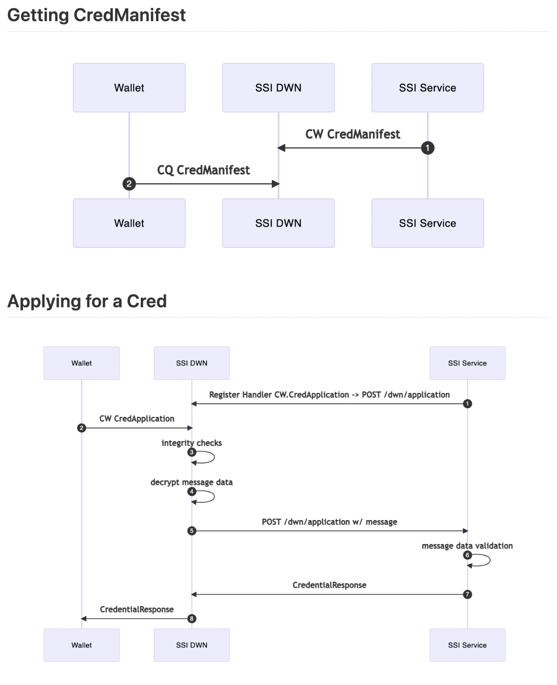
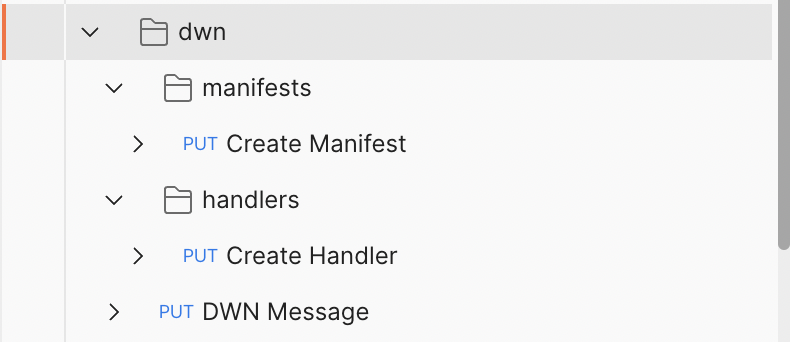
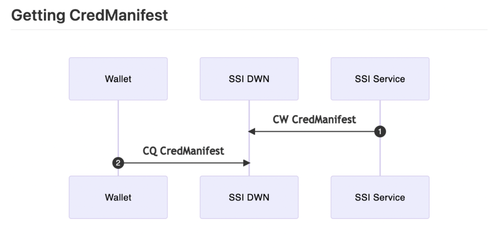

# SIP 4 DWN Message Processing

**SIP: *4***

**Title:** *SIP 4 Credential* Issuance Flow

**Author(s):** *Neal Roessler*

**Comments URI**: https://forums.tbd.website/t/sip-4-discussion-dwn-message-processing/137

**Status**: *Draft*

**Created: September** *20, 2022*

**Updated: September** *20, 2022*

# Abstract

The process described here is the full flow of DWN messages as they enter, are processed, and exit the SSI-Service. This will effectively be the implementation for DWN ←→ SSI-Service communication.

## Background

*What prior information outside of this spec is useful or necessary to understand this proposal?*

DWN - [https://identity.foundation/decentralized-web-node/spec/](https://identity.foundation/decentralized-web-node/spec/)

DWN message format - [https://identity.foundation/decentralized-web-node/spec/#messages](https://identity.foundation/decentralized-web-node/spec/#messages)

*What are the pre-requisites that need to be true for this work to succeed?*

- The DWN must have an endpoint for the SSI-Service to do a POST to
- The DWN needs to have register handler functionality

## Goals

*What is the purpose of this SIP? In bullet form, what are the goals and non-goals for this work?*

- Doing a POST request to a DWN node with a well formed DWN message
- A new /dwn endpoint that will accept and process dwn messages

---

# Specification

*Main area for going into your proposal, technical details with diagrams as necessary. It is ok to list multiple possible options, and outline your recommendation.*

### High level outline

This outline will describe the DWN ←→ SSI-Service communication process. This will be achieved through new packages written in golang inside of the SSI-Service codebase.

### Setup

The SSI-Service will have a configuration on startup that gives the endpoint information about the DWN. This gives a hard codependence on the SSI-Service to know about the DWN’s location to use DWN functionality. The SSI-Service will spin up just fine if this configuration is empty, but if you try to do any dwn/ routes an error response will be returned explaining that a DWN is needed and the endpoint must be configured. Also this binding implies that only one DWN will be associated with the SSI-Service

### Integration level outline

1. The SSI-Service will do a POST to the DWN with a DWN message containing the credential manifest object (an example of what this DWN message looks like is in the “PUT dwn” section)
2. The SSi-Service will do a POST with a callback url. It will give the endpoint for the SSI-Service DWN message handling route. (this may not be needed at all if the DWN setup is done on service startup)
3. The DWN will do a POST with any message to the dwn handling route



There will be three endpoints to achieve this.



**PUT dwn/**

```jsx
{
  "dwnMessage": {
    "descriptor": {
        "target": "did:example:alice",
        "recipient": "did:example:alice",
        "method": "CollectionsWrite",
        "protocol": "6f06bc3c-55ed-4c9f-bccf-1b4345363473",
        "contextId": "bob email X",
        "schema": "SubmitApplication",
        "recordId": "aa36ec55-c59b-4f20-8143-10f74aac696d",
        "nonce": "AXwHbetCnCCy8Q1ZSWE5X9yH1RKZ5ZXO",
        "dataCid": "bafybeihuzogd3utvlrw7dr3rb4kgzu43vqhlorvpzex33prwyqb777si5e",
        "dateCreated": 1663632617121,
        "dataFormat": "application/json"
    },
    "authorization": {
        "payload": "eyJkZXNjcmlwdG9yQ2lkIjoiYmFmeXJlaWVoaXVzZ214Y3Q0ejZieHg3emxsampyNzdybWdrNWlzbWZta3Rlcm1oeW5qMnp3aGkzczQifQ",
        "signatures": [
        {
            "protected": "eyJhbGciOiJFUzI1NksiLCJraWQiOiJkaWQ6ZXhhbXBsZTpib2Ija2V5MSJ9",
            "signature": "MEUCIQC1EC1A95c9Rs-0-_11QnJ0cuedKEPwAgfmDRLK-jVUYgIgd5agGdjriekepYLe94IXvdkID4lEiSTxqDgnF7SV8bs"
        }
        ]
    },
    "encodedData": "ZGF0YSBmcm9tIGJvYg"
    }
}
```

This route will process DWN messages. The first supported message will be a CollectionsWrite for submitting an application. This endpoint will listen to any DWN message over http. It will then translate these messages and call the functions necessary to complete the DWN message request if possible and supported.

**PUT dwn/manifests**



```jsx
{
  "manifetId": "manifest-Id-123",
}
```

This route will add a manifest to a DWN. This will find the existing manifest from the manifestId in the SSI-Service database, package it up into a DWN message, and do a POST to the DWN endpoint.

**PUT dwn/handlers**

```jsx
{
  "method": ["CollectionsWrite.CreateApplication", "CollectionsWrite.CreateDid"],
  "callbackUrl" :"http://localhost:8000/v1/dwn"
}
```

This route will add a callback to a DWN. In this example it will tell the DWN that when someone wants to do a CollectionsWrite it should go to the CollectionsWrite endpoint for the ssi-service.

---

# Considerations

## Tradeoffs

*What is lost with this approach? What is gained?*

This approach allows us to communicate with a DWN without too much added complexity. There is added complexity in knowing the anatomy of a DWN message but eventually when an SDK is built we can just call a few functions to get the end result we want

## Failure Modes & Mitigations

*What can go wrong and why? How can it be mitigated?*

Error handling will have to be managed by the DWN in this case and there will be no feedback saved on if a DWN post was successful or not

## Dependencies

*What dependencies exist between this and other pieces of work?*

DWN implementing a callback feature and an endpoint for posting Credential Manifests

## Future Work

*What work comes next/what does this enable?*

We will be able to issue credentials and all features of the SSI-Service and interact with a DWN.

## Security & Privacy

*What security and/or privacy implications are relevant to the proposed change?*

Infinite callback loop could potentially bring a denial of service or bring down the service. If we take off dynamic callbacks and just have it in service level startup config, then this security concern goes away.

---

# Release

## Success Criteria

*How will this work be tested? How will we know it was successful?*

A full unit test and integration test suit will be implemented with this change along with example use case implementation

## Rollout

*How is this work rolled out? What is the timeline? What type of version bump would this change result in? Would it deprecate existing functionality?*

Rollout would be similar to how the other pieces of ssi service have been deployed by creating a pull request from a branch and merging it in after proper scrutiny

---

# References

*Enumeration of content links used in this document*

A [Decentralized Web Node](https://identity.foundation/decentralized-web-node/spec/) (DWN) is a data storage and message relay mechanism entities can use to locate public or private permissioned data related to a given Decentralized Identifier (DID). Decentralized Web Nodes are a mesh-like datastore construction that enable an entity to operate multiple nodes that sync to the same state across one another, enabling the owning entity to secure, manage, and transact their data with others without reliance on location or provider-specific infrastructure, interfaces, or routing mechanisms.

- [https://identity.foundation/decentralized-web-node/spec/](https://identity.foundation/decentralized-web-node/spec/)
