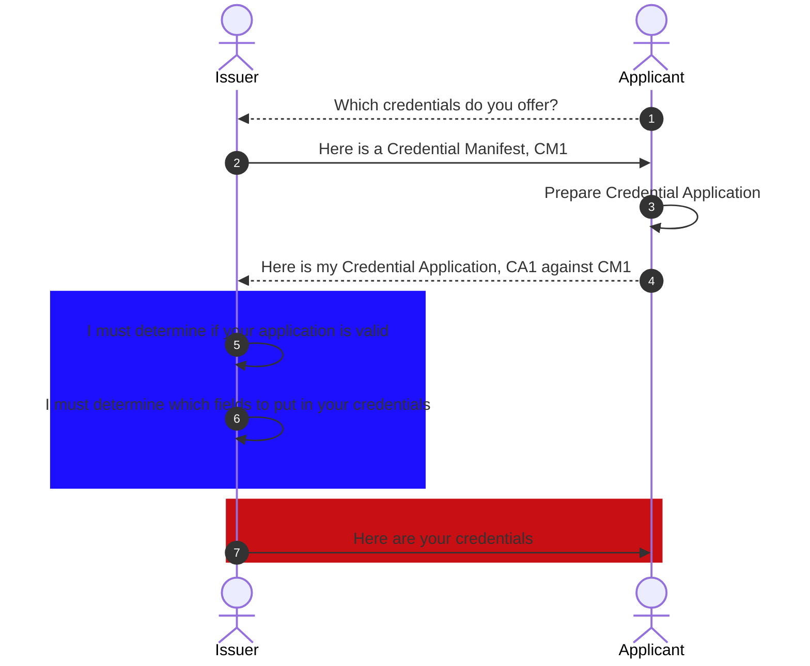
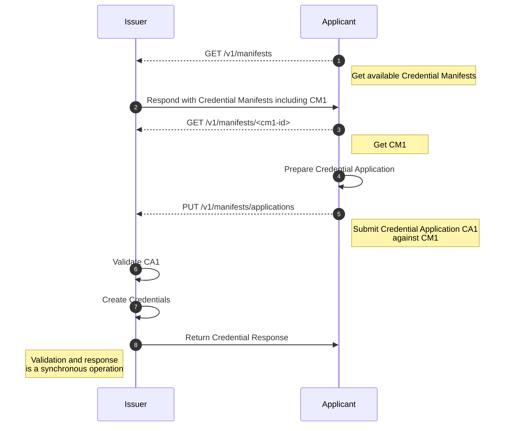
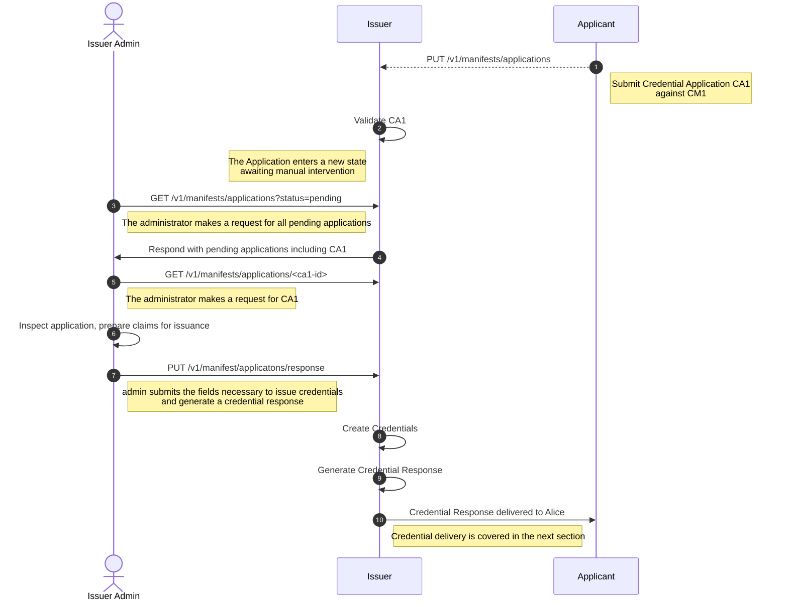
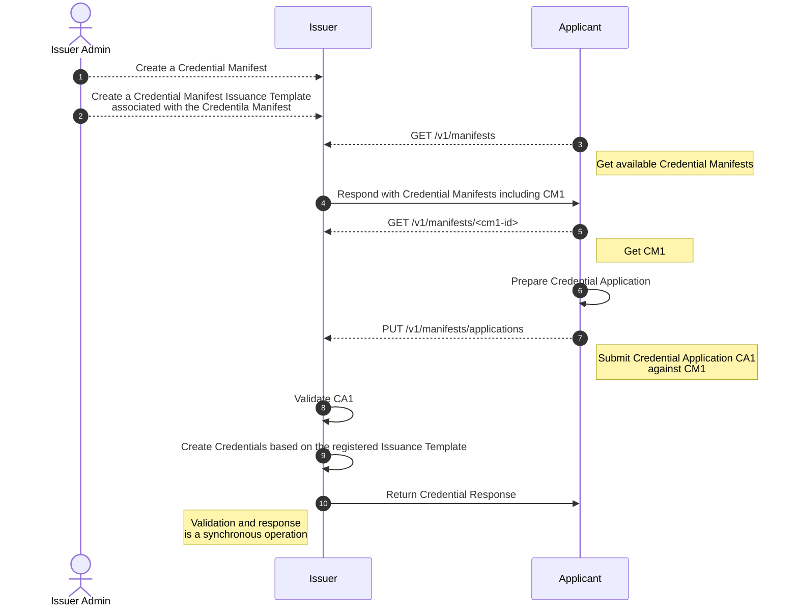

# SIP 5 Credential Application Processing

```yaml
SIP: 5
Title: Credential Application Processing
Author(s): Gabe Cohen (@decentralgabe)
Comments URI: https://forums.tbd.website/t/sip-4-discussion-credential-application-processing/198
Status: Accepted
Created: October 31, 2022
Updated: November 30, 2022
```

# Abstract

The [Credential Manifest](https://identity.foundation/credential-manifest/) specification is implemented in the SSI SDK and Service in order to facilitate applying for credentials. As part of the process, data is submitted to the service from an applicant and a decision is made to either issue credential(s), hence *fulfilling the application,* or to *****************deny the application*****************. This proposal covers two main pieces of functionality in this flow:

1. Giving issuers a way to make a decision whether to issue credential(s)
2. Choosing which credential(s) to issue and which data to put in those credential(s)

## Background

[Credential Manifest](https://identity.foundation/credential-manifest/) is approaching v1 in DIF and it is implemented in both the [SSI SDK](https://github.com/TBD54566975/ssi-sdk/tree/main/credential/manifest) and [SSI Service](https://github.com/TBD54566975/ssi-service/tree/main/pkg/service/manifest). The implementation of the specification is a standards-based mechanism for (a) issuers to advertise which credentials they issue and the requirements for being issued these credentials, (b) DID-identified parties to apply for a credential, and (c) issuers to review credential applications and choose to either fulfill them (issuing credential(s)) or deny the application. 

Credential Issuance is a concept that answers the question “how does someone get a credential?”. There are two categories of receiving a credential which can further be subdivided:

1. You give yourself a credential
2. Someone gives a credential to you

The first category is often referred to as “self-issuance” or “self-signed credentials” and is out of scope of this proposal. The second category can be subdivided into:

1. You are given a credential without intervention
2. You are given a credential because you’ve requested it

Credential issuance without intervention can be imagined with such scenarios as getting a birth certificate upon being born (you most certainly did not ask for it!) or an employer choosing to issue all employees an employment verification credential. These cases are out of scope of this proposal.

This proposal assumes that someone has asked for a credential — using the Credential Manifest specification — and now an issuer must respond to that request. Specifically, this proposal answers the question from the perspective of an issuer “how do I process an application and determine which credential(s) to issue to an application and which field(s) to include in those credential(s)”.

## Goals

**Goals**

- Provide options for an issuer to review a credential application
- Provide options for an issuer to determine which credentials they wish to issue and the fields to include in those credentials
- Prepare for a more robust integration of business logic with external systems using technologies such as web hooks

**Non-goals**

- Handle credential issuance outside the scope of credential manifest
- Assume behaviors or handle interaction with systems external to the SSI Service

## Contents

---

# Specification

*The examples I show will not show authenticated payloads for the sake of simplicity.* 

A [Credential Manifest](https://identity.foundation/credential-manifest/#credential-manifest) specifies [output_descriptors](https://identity.foundation/credential-manifest/#output-descriptor) which is an array of schema-based credentials a manifest advertises it issues along with some display information. A manifest may specify 1 or more credentials it issues. To issue these credentials a Credential Manifest optionally specifies a `presentation_definition` object, notably specifying [input_descriptors](https://identity.foundation/presentation-exchange/#input-descriptor) which specifies information the issuer of the manifest requires in order to produce the output descriptors.

An example of one such interaction enabled by Credential Manifest is illustrated below. For simplicity we show the Issuer interacting directly with the Applicant, though normally there will be services and wallets in the mix.



The highlighted regions of the document is what is in question. We can break up the design into three parts: *application processing*, *credential issuance*, and *credential delivery*.

Today we make the following choices:

**Application Processing –** The application’s signature is validated. The application is statically validated to determine whether it is compliant with the specification and next if it matches the Credential Manifest it’s associated with. Each input descriptor and associated credential are checked to determine whether they fulfill the manifest’s input descriptors. For each credential provided they have their signature’s validated, and other validity checks (e.g. has the credential expired? is it valid against its schema? is it revoked?). 

**************************************Credential Issuance –************************************** Credentials are issued according to the schema noted in the Manifest however with no properties except the `id` field, noting the subject of the credential (the applicant).

**************************************Credential Delivery –************************************** The Credential Response is returned in a synchronous request to the caller after submitting a Credential Application.

In each of these dimensions there’s room for improvement.

## Application Processing

Credential Application processing is the most robust piece of this interaction. The main room for improvement is for the SSI Service administrator to be able to configure the validity and verification checks they wish to do on the application and its associated credentials. 

Another idea is for a more interactive protocol. This could mean an application is partially complete or not sufficiently fulfilled in the eyes of the issuer. Today, this results in a [Credential Denial](https://identity.foundation/credential-manifest/#credential-response) response with included reason(s) for why the application was not accepted. In the future this could be expanded to perhaps include an ********************Application Amendment******************** step where the Issuer responds with a follow up message asking for a revised application before proceeding with a Credential Response.

**Changes to Credential Application processing are out of scope of this SIP.**

## Credential Issuance

Today our credential issuance is naive, and we include no claims in issued credentials past the `id` property identifying the subject. These credentials have a risk of not being valid against the schema specified in the Credential Manifest, and are not very interesting or useful. For a credential to be interesting and useful it needs data. So, how does an issuer determine which data should make it into a credential in this interaction? As I see it we have two (and a half) main paths:

1. **Manual issuance** that allows an issuer to view an application and submit the fields they wish to include in each credential.
2. **Automated issuance** via a templating that allows issuers to use a [JSON Path based](https://goessner.net/articles/JsonPath/index.html) templating syntax to a priori create templates which take fields from a Credential Application and put them into the Credentials to be issued.
3. A hybrid approach that applies a template for some fields and allows manual intervention for other fields.

Option 1 is the simplest, and I believe we should do it right away. Option 2 is more complex in terms of development effort and issuer setup though it would be simplest for issuers for many credential types. Option 3 (2.5) is a natural extension of Options 1 and 2. Let’s get into a bit more detail of how options 1 and 2 would be implemented.

First, let’s augment the earlier example to show which APIs are used in the service, what they do, and where we will make changes.



### Manual Issuance

To support manual issuance we’ll need to introduce a change at step (5) making the **********************application submission********************** step asynchronous. For brevity, the beginning of the example is excluded.



The steps are as follows:

1. The SSI Service receives a Credential Application to `PUT /v1/manifests/applications`
    1. The application is validated (signatures, against the manifest, has required properties)
    2. If these checks fail an error and/or credential denial is returned synchronously
2. The Credential Application enters a *******pending******* state where it is awaiting manual intervention by the SSI Service Administrator (Issuer)
3. The issuer makes a request to `GET /v1/manifests/applications?status=pending` filtering for applications that are in the *******pending******* state
4. The issuer makes a follow-up request to get the specific application they are interested in `GET /v1/manifests/applications/<ca1-id>`
    1. The issuer reviews the credential application
5. The issuer has an option to either fulfill or deny the application, submitting a Credential Response. If the Response is a ******denial****** a reason is provided. If the response is a ***********fulfillment*********** the issuer provides a JSON object for each credential to be issued containing the claims and settings for the credentials to be issued according to the existing [CreateCredentialRequest object](https://github.com/TBD54566975/ssi-service/blob/main/pkg/service/credential/model.go#L11). Example:

**Note:** `issuer` and `subject` properties are omitted, since we already have that information at this point. Issuer = Creator of the Credential Manifest. Subject = Creator of the Credential Application.

```json
{
	"credentialApplication": "ca-1",
  "response": "fulfillment",
  "credentials": [
    {
     "schema": "https://example.com/license",
     "data": {
       "firstName": "Alice",
       "lastName": "Bobertson",
       "state": "CA",
       "class": "M1"
     },
     "expiry": "2025-05-05T05:05:05Z"
    },
    {
     "schema": "https://example.com/drivingTestCertificate",
     "data": {
       "firstName": "Alice",
       "lastName": "Bobertson",
       "state": "CA",
       "testDesigation": "Test-2022-M1",
       "grade": "95%",
			 "dateTaken": "2022-05-05T05:05:05Z"
     }
    }
  ]
}
```

1. The SSI Service receives the request and generates the resulting credentials.
2. The Credential Response is ready for delivery to the Applicant. This is detailed in the section below.

### Automated Issuance

Automated issuance looks remarkably similar to what we have in the service today, with one notable set up step: the issuer creating a template associated with a credential manifest.



The issuance template is a new object that is able to pull out data from a Credential Application and put it into Credentials to be issued.

Assuming we have a Credential Manifest that looks like this, which has a single `input_descriptor` requiring a Drivers License Credential and a single `output_descriptor` issuing a KYC Credential:

```json
{
	"credential_manifest": {
		"id": "drivers-license-kyc-issuance",
		"spec_version": "https://identity.foundation/credential-manifest/spec/v1.0.0/",
		"issuer": {
			"id": "did:key:z6MkgMFBk7uEtrYiMZFfPFfxga9S8ahttjsFwbFzNLG2F3rg"
		},
		"output_descriptors": [{
			"id": "kyc_credential",
			"schema": "bc77954b-57fc-4d5c-bfff-a6acb2a17b60"
		}],
		"presentation_definition": {
			"id": "32f54163-7166-48f1-93d8-ff217bdb0653",
			"input_descriptors": [{
				"id": "kyc1",
				"name": "Personal Info",
				"constraints": {
					"fields": [{
							"path": ["$.vc.credentialSubject.givenName"],
							"id": "givenName",
							"filter": {
								"type": "string",
								"pattern": "[a-zA-Z \\-\\.].+"
							}
						},
						{
							"path": ["$.vc.credentialSubject.additionalName"],
							"id": "additionalName",
							"filter": {
								"type": "string",
								"pattern": "[a-zA-Z \\-\\.].+"
							}
						},
						{
							"path": ["$.vc.credentialSubject.familyName"],
							"id": "familyName",
							"filter": {
								"type": "string",
								"pattern": "[a-zA-Z \\-\\.].+"
							}
						},
						{
							"path": ["$.vc.credentialSubject.birthDate"],
							"id": "birthDate",
							"filter": {
								"type": "string",
								"format": "date"
							}
						},
						{
							"path": ["$.vc.credentialSubject.postalAddress"],
							"id": "postalAddress",
							"filter": {
								"type": "string"
							}
						},
						{
							"path": ["$.vc.credentialSubject.taxID"],
							"id": "taxID",
							"filter": {
								"type": "string"
							}
						}
					],
					"subject_is_issuer": "required"
				}
			}],
			"name": "KYC Requirements",
			"purpose": "TBD",
			"format": {
				"jwt": {
					"alg": [
						"EdDSA"
					]
				}
			}
		}
	}
}
```

We can imagine an **Issuance Template** that corresponds to it looking like this: 

```json
{
 "credentialManifest": "drivers-license-kyc-issuance",
 "issuer": "did:key:z6MkgMFBk7uEtrYiMZFfPFfxga9S8ahttjsFwbFzNLG2F3r",
 "credentials": [
  {
   "id": "kyc_credential",
   "schema": "bc77954b-57fc-4d5c-bfff-a6acb2a17b60",
   "data": {
       // This means use the credential that fulfills this input descriptor
       // NOTE: we are making an assumption of 1 credential = 1 input descriptor
       "credentialInputDescriptor": "kyc1",
       "firstName": "$.credentialSubject.firstName",
       "lastName": "$.credentialSubject.lastName",
       "state": "CA",
    },
   "expirationDate": "2025-05-05T05:05:05Z"
  }
 ]
}
```

The templating language is able to do a few interesting things:

- Pull data out of credentials that fulfill certain input descriptors. We already have the capability to determine which credentials fulfill which input descriptors, so this is simple.
- Support static field definitions. For example, the issuer can define that a property is always going to be a specific value. In the example above, the state is ********************always CA********************.
- Support dynamic field definitions. To start this can be a simple notation that handles date-time values alone for `expirationDate` and claims in a credential that may include date-time values. This could be simplified by having parties just supply a timestamp.

Expanding on this to handle Option 2.5 from above, we could introduce a new option to state “MANUAL” which means it will need to be manually filled out by the issuer. Mixing both automatically fulfilled and manual credential issuance.

## Credential Delivery

Today credentials are delivered synchronously to applicants. With the introduction of processing logic, and manual steps, this isn’t always possible. There are two options for credential delivery:

1. Pick up a Credential Response by polling the SSI Service

This is the simplest option. A credential response will be surfaced at `/v1/manifests/applications/<application-id>` which can be polled for by the applicant.

1. Provide a callback URI to the SSI Service upon Application submission where the Response can be sent

The URI will be added to the existing request to submit a Credential Application. Some light configuration can be put in place to specify how the request should be sent. Something like…

```json
"responseConfig": {
  "callbackUri": "https://my-wallet.com/response",
  "method": "POST",
  "mimeType": "application/json",
  "retry": "3",
  "retryInterval": "5000" // time in seconds between retries
}
```

**NOTE**: This has a DoS risk and should be limited to a set of options provided by the administrator, or removed entirely.

---

# Considerations

## Failure Modes & Mitigations

- Without proper security controls on the service, this approach could expose certain risks
    - This is a known issue, and auth is intended to be handled outside of the service - this may change later

## Dependencies

- This work unlocks tie in to external systems for additional business logic
- This work is a requirement for “real” credential issuance using credential manifest
- Credential Manifest objects today do not support updating. This design may be impacted if issuers are able to update manifests.

## Future Work

- External system integration via webhooks
- Support updating and handling versioning of manifest objects.

## Security & Privacy

- Authenticated payloads and transport layer security can be used to reduce message interception and data leakage
- Retry config should not be able to be fully specified by the client as this could open up a DoS attack

---

# Release

## Success Criteria

- Unit and integration tests
- System tests to follow

## Rollout

- It is easiest to start with a new set of APIs to do the manual approach
- Following, we can add templating
- Similarly, we can start with polling and later add callbacks.

---

# References

- [https://identity.foundation/credential-manifest/](https://identity.foundation/credential-manifest/)
- [https://identity.foundation/presentation-exchange/](https://identity.foundation/presentation-exchange/)
- [https://goessner.net/articles/JsonPath/index.html](https://goessner.net/articles/JsonPath/index.html)
