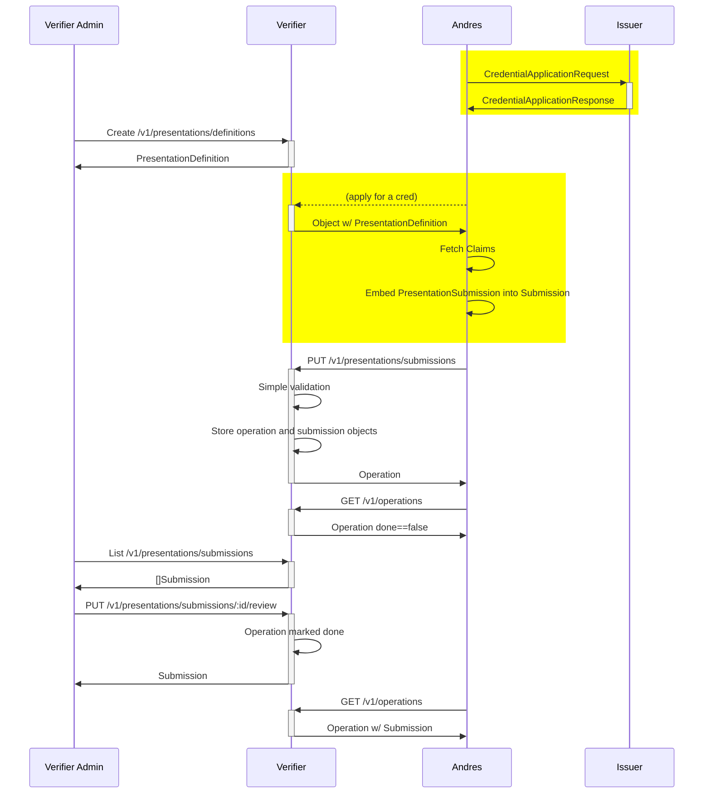

# SIP 6: Presentation Exchange with long running Operations

```yaml
SIP: 6
Title: SIP 6 - Presentation Exchange with long running Operations
Author(s): Andres Uribe
Status: Accepted
Created: Nov 2, 2022
Updated: Nov 8, 2022
Discussion: https://forums.tbd.website/t/sip-6-presentation-exchange-with-long-running-operations
```

# Abstract

A design for integrating presentation exchange into the SSI service that will make it easy for any developer to deal with presentation exchanges.

## Background

[https://identity.foundation/presentation-exchange/](https://identity.foundation/presentation-exchange/)

The use case to ground things on the following real world use case:

1. TBD extends an offer to a prospective employee, Andres.
    1. Offer is contingent on the employee proving (or submitting) additional information. 
2. TBD defines what proofs they require from Andres. For a simple case, let’s focus only on proof of employment eligibility.
3. TBD communicates that they need proof of employment to Andres.
4. Andres gathers this information, and sends it to TBD.
5. TBD processes the information, deciding whether it’s acceptable or not.

In DIF parlance, this is the mapping the results.

| Use Case Parlance | Formally is |
| --- | --- |
| TBD | Verifier |
| Andres | Holder |
| Need proof of employment | Presentation Definition |
| Communicating the needs to Andres | Presentation Request |
| Andres sending the information. | Presentation Submission |
| Green Card (employment eligibility) | Claim (likely using with a Verifiable Credential format) |

Now, for the use case above, we can imagine that TBD and Andres both want to very quickly implement these interactions using SSI service. The goal of this document is to provide all the necessary functionality for doing so.

## Goals

- Design CRUD functionality in SSIS for Presentation Definitions.
- Define mechanism through which PresentationSubmissions will be communicated.
- Defining a polling mechanism for long running operations.

### Non-goals

- Establishing a rigid Presentation Request format.

## Contents

---

# Specification

The diagram depicts a typical flow where a presentation request is below.

*Note the* 🟨 ***yellow*** 🟨 *boxes are out of scope in this SIP.*



The following endpoints will be added within the `presentations` namespace

- `/v1/presentations/definitions`
    - Standard REST based verbs on the `PresentationDefinition` resource.
    - The definitions will be stored within the database, keyed by id.
- `/v1/presentations/submissions`
    - All verbs act  on the `Submission` resource. `Submission` might be anything which contains a `presentation_submission` embedded object, and an output-only `status` field.
    - PUT that shall return an object of type `Operation` (inspired by google’s AIP’s [operation](https://github.com/googleapis/googleapis/blob/153e9592bb199fd55d800b0e7482eeb128ed8b25/google/longrunning/operations.proto#L128)).
    - GET will be by `id`. It’s determined by the `submission_id`.
    - List for `/v1/presentations/submissions`, with the ability to filter by `status`
    - Custom verb `verify` , which marks the associated `Operation` as `done == true`.
- `/v1/presentations/submissions/operations`
    - Get, List, and Cancel methods shall be supported. The resource will be of type `Operation`.
    - List will have the ability to filter by `done==false`

## /v1/presentations/definitions - CRUD for PresentationDefinition

The resource accepted will be conform to the JSON schema [https://identity.foundation/presentation-exchange/#presentation-definition-in-an-envelope](https://identity.foundation/presentation-exchange/#presentation-definition-in-an-envelope). Below is a minimal example of what it would look like.

```json
{
  "presentation_definition": {
    "id": "32f54163-7166-48f1-93d8-ff217bdb0653",
    "input_descriptors": [
      {
        "id": "wa_driver_license",
        "name": "Washington State Business License",
        "purpose": "We can only allow licensed Washington State business representatives into the WA Business Conference",
        "constraints": {
          "fields": [
            {
              "path": [
                "$.credentialSubject.dateOfBirth",
                "$.credentialSubject.dob",
                "$.vc.credentialSubject.dateOfBirth",
                "$.vc.credentialSubject.dob"
              ]
            }
          ]
        }
      }
    ]
  }
}
```

Supported methods will be:

- PUT - stores the definition in storage.
- GET - retrieves the definition with a given `id`.
- DELETE - deletes the definition with a given `id`.

## /v1/presentations/submissions

### Storage

Submission objects will be stored in the KV store, keyed by the `presentation_submission.id`. Internally, we’ll keep track of the review state. This field will be used to populate the `status` field which will be a read-only field.

### PUT

A `Submission` object:

- ********MUST******** contain `presentationJwt` of type string, which is a JWT verifiable presentation. That is, the payload has a field named `vp` .
    - The value of `vp` **MUST** contain an embedded `presentation_submission` object. The object conforms to the JSON schema [https://identity.foundation/presentation-exchange/#presentation-submission-2](https://identity.foundation/presentation-exchange/#presentation-submission-2).
    - The `vp` object must conform to [https://www.w3.org/TR/vc-data-model/#presentations-0](https://www.w3.org/TR/vc-data-model/#presentations-0)
    - The signature **MUST** refer to the `vp.holder`
    - Each item in the `vp.verifiableCredential` MUST:
        - Be a JWT verifiable credential according to [https://www.w3.org/TR/vc-data-model/#json-web-token](https://www.w3.org/TR/vc-data-model/#json-web-token)
        - Have the signature refer to the issuer, as determined by the `iss` claim.

*Note: the example below is associated with the presentation definition example from above.*

```json
{
  "status": "", // this is an output-only field. Valid values will be: PENDING, VERIFIED, DENIED.
  "presentationJwt": "eyJhbGciOiJIUzI1NiIsInR5cCI6IkpXVCJ9.eyJpc3MiOiJkaWQ6d2ViOmFuZHJlc3VyaWJlLmNvbSIsInZwIjp7InByZXNlbnRhdGlvbl9zdWJtaXNzaW9uIjp7ImlkIjoiYTMwZTNiOTEtZmI3Ny00ZDIyLTk1ZmEtODcxNjg5YzMyMmUyIiwiZGVmaW5pdGlvbl9pZCI6IjMyZjU0MTYzLTcxNjYtNDhmMS05M2Q4LWZmMjE3YmRiMDY1MyIsImRlc2NyaXB0b3JfbWFwIjpbeyJpZCI6IndhX2RyaXZlcl9saWNlbnNlIiwiZm9ybWF0Ijoiand0X3ZwIiwicGF0aCI6IiQuY3JlZGVudGlhbHNKd3RbMF0ifV19LCJpZCI6ImE5YjU3NWM3LWJhYzItNDdlNy1hOTI1LWM0MzI4MTVlYmI0YyIsInR5cGUiOlsiVmVyaWZpYWJsZVByZXNlbnRhdGlvbiJdLCJob2xkZXIiOiJkaWQ6d2ViOmFuZHJlc3VyaWJlLmNvbSIsInZlcmlmaWFibGVDcmVkZW50aWFsIjpbImV5SmhiR2NpT2lKSVV6STFOaUlzSW5SNWNDSTZJa3BYVkNKOS5leUpwYzNNaU9pSmthV1E2ZDJWaU9tUnZiQzUzWVM1bmIzWWlMQ0pxZEdraU9pSTNNRE0xWVRkbFl5MDJObU00TFRSaFpXTXRPVEU1TVMxaE16UmxPR05tTVdVNE1tSWlMQ0p1WW1ZaU9qRTJOamM0TlRZMU16Y3NJbk4xWWlJNkltUnBaRHAzWldJNllXNWtjbVZ6ZFhKcFltVXVZMjl0SWl3aWRtTWlPbnNpUUdOdmJuUmxlSFFpT2xzaWFIUjBjSE02THk5M2QzY3Vkek11YjNKbkx6SXdNVGd2WTNKbFpHVnVkR2xoYkhNdmRqRWlYU3dpYVdRaU9pSTNNRE0xWVRkbFl5MDJObU00TFRSaFpXTXRPVEU1TVMxaE16UmxPR05tTVdVNE1tSWlMQ0owZVhCbElqcGJJbFpsY21sbWFXRmliR1ZEY21Wa1pXNTBhV0ZzSWwwc0ltbHpjM1ZsY2lJNkltUnBaRHAzWldJNlpHOXNMbmRoTG1kdmRpSXNJbWx6YzNWaGJtTmxSR0YwWlNJNklqSXdNakl0TVRFdE1EZFVNakU2TWpnNk5UZGFJaXdpWlhod2FYSmhkR2x2YmtSaGRHVWlPaUl5TURVeExURXdMVEExVkRFME9qUTRPakF3TGpBd01Gb2lMQ0pqY21Wa1pXNTBhV0ZzVTNWaWFtVmpkQ0k2ZXlKaFpHUnBkR2x2Ym1Gc1RtRnRaU0k2SWsxamJHOTJhVzRpTENKa1lYUmxUMlpDYVhKMGFDSTZJakU1T0RjdE1ERXRNRElpTENKbVlXMXBiSGxPWVcxbElqb2lRVzVrY21Weklpd2laMmwyWlc1T1lXMWxJam9pVlhKcFltVWlMQ0pwWkNJNkltUnBaRHAzWldJNllXNWtjbVZ6ZFhKcFltVXVZMjl0SW4xOWZRLi1LaGMzbVF5clRXdEZxLXZ2TldGZlN4UDJyV3RQaWZsYWlYQkdXRDIzMDQiXX19.CCw4igFfI0d4ATjEbf54Y1dqdsO-akZa5TWBAu8NNKk"  // signed JWT who's payload is described below. This JWT was signed with the holder's key, i.e. 'andres-has-amazing-secrets'
}

// The decoded JSON payload from the `presentationJwt` field.
{
  "iss": "did:web:andresuribe.com",
  "vp": {
    "presentation_submission": {
	    "id": "a30e3b91-fb77-4d22-95fa-871689c322e2",
	    "definition_id": "32f54163-7166-48f1-93d8-ff217bdb0653",
	    "descriptor_map": [
	      {
	        "id": "wa_driver_license",
	        "format": "jwt_vp",
	        "path": "$.vp.verifiableCredential[0]"
	      }
	    ]
	  },
    "id": "a9b575c7-bac2-47e7-a925-c432815ebb4c",
    "type": ["VerifiablePresentation"],
    "holder": "did:web:andresuribe.com",
    "verifiableCredential": [
      "eyJhbGciOiJIUzI1NiIsInR5cCI6IkpXVCJ9.eyJpc3MiOiJkaWQ6d2ViOmRvbC53YS5nb3YiLCJqdGkiOiI3MDM1YTdlYy02NmM4LTRhZWMtOTE5MS1hMzRlOGNmMWU4MmIiLCJuYmYiOjE2Njc4NTY1MzcsInN1YiI6ImRpZDp3ZWI6YW5kcmVzdXJpYmUuY29tIiwidmMiOnsiQGNvbnRleHQiOlsiaHR0cHM6Ly93d3cudzMub3JnLzIwMTgvY3JlZGVudGlhbHMvdjEiXSwiaWQiOiI3MDM1YTdlYy02NmM4LTRhZWMtOTE5MS1hMzRlOGNmMWU4MmIiLCJ0eXBlIjpbIlZlcmlmaWFibGVDcmVkZW50aWFsIl0sImlzc3VlciI6ImRpZDp3ZWI6ZG9sLndhLmdvdiIsImlzc3VhbmNlRGF0ZSI6IjIwMjItMTEtMDdUMjE6Mjg6NTdaIiwiZXhwaXJhdGlvbkRhdGUiOiIyMDUxLTEwLTA1VDE0OjQ4OjAwLjAwMFoiLCJjcmVkZW50aWFsU3ViamVjdCI6eyJhZGRpdGlvbmFsTmFtZSI6Ik1jbG92aW4iLCJkYXRlT2ZCaXJ0aCI6IjE5ODctMDEtMDIiLCJmYW1pbHlOYW1lIjoiQW5kcmVzIiwiZ2l2ZW5OYW1lIjoiVXJpYmUiLCJpZCI6ImRpZDp3ZWI6YW5kcmVzdXJpYmUuY29tIn19fQ.-NO7vVdeMMqIs1oEmohsZSRJLxPolFFz3uusZqU3laY" // signed JWT who's payload is described below. This JWT was signed with the issuer's key, i.e. 'dol-wa-super-secret-pk'
    ]
  }
  // proof will be done via JWT signing, so it's ommited.
}

// The decoded JSON payload from the vp.verifiableCredential[0] field.
{
  "iss": "did:web:dol.wa.gov", // this is the WA state that issued Andres' license.
  "jti": "7035a7ec-66c8-4aec-9191-a34e8cf1e82b",
  "nbf": 1667856537,
  "sub": "did:web:andresuribe.com",
  "vc": {
    "@context": [
      "https://www.w3.org/2018/credentials/v1"
    ],
    "id": "7035a7ec-66c8-4aec-9191-a34e8cf1e82b",
    "type": [
      "VerifiableCredential"
    ],
    "issuer": "did:web:dol.wa.gov",
    "issuanceDate": "2022-11-07T21:28:57Z",
    "expirationDate": "2051-10-05T14:48:00.000Z",
    "credentialSubject": {
      "additionalName": "Mclovin",
      "dateOfBirth": "1987-01-02",
      "familyName": "Andres",
      "givenName": "Uribe",
      "id": "did:web:andresuribe.com"
    }
  }
}
```

Upon a submission, the following steps will be performed:

1. Verify that the `vp.holder` is the signer of `presentationJwt`.
2. Verify that the `submission_id` doesn’t already exist.
3. Check that the request is well formed.
4. Let presentationJSON be the decoded JWT payload.
5. Check that `presentationJSON.presentation_submission` is well formed.
6. Check that the `presentation_submission.definition_id` exists in the service as a `presentation_definition`
7. Verify that all the claims are authentic. I.e. verify the signature for all elements in  `presentationJSON.vp.verifiableCredentials` corresponds to the issuer.
8. Check that the contents for `descriptor_map` covers all the requested fields from the associated `presentation_definition`
9. Check that the paths are resolvable to fields in the claims. This should follow the spec as described in [https://identity.foundation/presentation-exchange/#processing-of-submission-entries](https://identity.foundation/presentation-exchange/#processing-of-submission-entries)
10. A `Submission` is stored in the DB.
11. An operation ID is generated, and an operation is stored in a KV database.
12. A response of type `Operation` is sent back to the client with `id := "presentations/submissions/{submission_id}"`
13. Bask in the glory of a successful submission.

### GET

By `id` and will return the `Submission` that satisfies `presentation_submission.id == id`. 

### LIST

A typical operation that an admin would like to see is all the pending submissions that have been submitted. They’ll be able to hit the `/v1/presentations/submissions` endpoint. The request parameters will be the following.

```json
{
  "filter": "status:pending AND definition_id:32f54163-7166-48f1-93d8-ff217bdb0653", // a filter expression conforming to https://google.aip.dev/160
}
```

⚠️ ****************************************We are consciously omitting pagination in this iteration to reduce complexity.**************************************** 

The response will contain an array of `Submission` objects. 

The filter field will be parsed according to the [filtering grammar](https://google.aip.dev/assets/misc/ebnf-filtering.txt). Implementation will be done using this [aip-go package](https://github.com/einride/aip-go/blob/master/filtering/request.go#L9).

### Review

The URL is `/v1/presentations/submissions/:id/review`. This endpoint enables admins to record their decision related to a claim. A request with the following parameters should be sent.

```json
{
  "approved": false,
  "reason": "i don't like your shoes"
}
```

Ideally, only the `TBD Admin` should have authorization to perform this. After this method is called, the operation with `id==presentations/submissions/{submission_id}` will be updated with the result of this invocation (and the `done` field will be set to true). The `submission` object’s review state will be updated as well.

The response of this endpoint will contain a `Submission` object with `status != 'pending'`.

## Long running operations - /v1/operations

After a client submits a request which can take a long time, they will get back an `Operation` object. Clients can then use the `/v1/operations` endpoint to query the status of the operation, and retrieve the result or error of the operation. 

An object of type `Operation` and will look as follows

```json
{
  "id": "/{namespace}/{unique_id}", // example: "presentations/submissions/a30e3b91-fb77-4d22-95fa-871689c322e2"
  "done": true, // when "false", then "result" will be empty as it's still being calculated.
  "result": { // only present when "done" == true. When present only one of ["error", "response"] will be populated.
    "error": "some string with the error",
    "response": {}// embeded Submission object
  }
}
```

Internally, we will store operations in a KV store, where the keys are the Operation’s id.

Note that this endpoint in not specific to an API call. As such, this can be easily composed with any API call in the future that can be long running.

### **GET**

- By `id` passed in via url_params.

### **LIST**

The request will look as follows

```json
{
  "parent": "presentations/submissions/", // represents the name of the parent's resource
  "filter": "done:false", // a filter expression, for any filtering needs
}
```

⚠️ ****************************************We are consciously omitting pagination in this iteration to reduce complexity.****************************************

### **CANCEL - /v1/operation/cancel**

- By `id` passed in via url_params. This will result in the cancellation and subsequent deletion of the operation. Only operation’s who’s `status == 'pending'` can be cancelled.

# Considerations

## Alternatives

It’s possible that creating an in-memory cache of `presentation_definition` objects is desirable. The size is likely to be small, and they’re going to be used against multiple submissions. While that’s a valid concern, maintaining a cache introduces complexity. In the spirit of simplicity, we’re leaving that as a potential optimization for the future.

For operations, we could alternatively split operations by URL related to the API that created the operation object. For example, instead of having a single `/v1/operations` endpoint, we could have `/v1/presentations/submissions/operations`. Semantically, both would be equivalent. The former was preferred in order to reduce the API surface.

### FAQ

- **What about replay protection?**
    - We’re holding off from designing the actual format for the PresentationRequest. For now, we’re going to assume that a PresentationDefinition will make it’s way to Andres.
- **PresentationDefinitions are already present in CredentialManifests. Should we normalize them?**
    - We’re focusing on simplicity and speed of iteration for now. This is something we might look into in the future, when there is an explicit use case that calls for it.

## Tradeoffs

We are explicitly not supporting any sort of pagination yet. This decision is in order to minimize complexity.

## Failure Modes & Mitigations

N/A

## Dependencies

This proposal is related to any API that will return long running operations. One such example is 

[SIP 5 Credential Application Processing](https://www.notion.so/SIP-5-Credential-Application-Processing-d809c3c3b9974c1c8eaac13adfb2c0c4)

## Future Work

API’s that return `Operation` objects can be extended so they accept a callback URI from the caller

## Security & Privacy

Not everyone should be allowed to record decisions related to claim submissions. Authn will be handled in a separated SIP.

---

# Release

## Success Criteria

Unit tests

Integration tests

## Rollout

N/A

---

# References

- [https://identity.foundation/presentation-exchange/](https://identity.foundation/presentation-exchange/)
- [https://google.aip.dev/151](https://google.aip.dev/151)
- [SIP 5 Credential Application Processing](https://www.notion.so/SIP-5-Credential-Application-Processing-d809c3c3b9974c1c8eaac13adfb2c0c4)