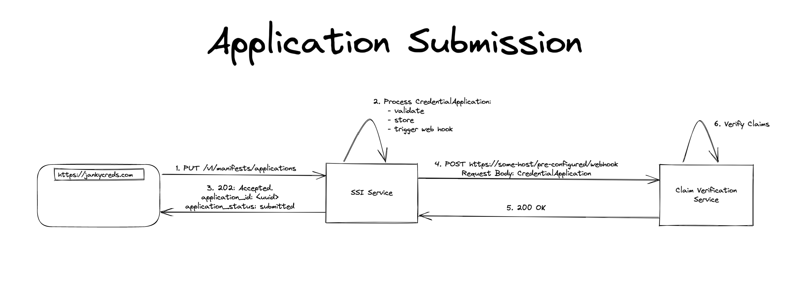

# SIP 8 Webhooks for External Services

```yaml
SIP: 8
Title: Webhooks for External Services
Author(s): Neal (@nitro-neal)
Comments URI: Link to a GitHub issue, pull request, or forum post for discussion
Status: Draft
Created: December 8, 2022
Updated: December 8, 2022
Discussion: Link to a forum post: TBD
```

# Abstract

As the SSI-Service grows in complexity, we need to add webhooks for certain tasks related to credential processing in the back office. Webhooks can provide a flexible and efficient way for the SSI-Service to communicate with other systems or services.

With fully configurable webhooks, the SSI-Service will be able to specify the specific events that should trigger a webhook, as well as the URL that should be called when the event occurs. This will allow the SSI-Service to customize the behavior of the webhooks to meet the specific needs of the back office processing.

For example, the SSI-Service may want to set up a webhook that is triggered whenever a new credential is issued. This webhook could be configured to send a notification to the back office system, which could then handle the credential and update any relevant records.

## Background

Webhooks are a way for an app to provide other applications with real-time information. This is done by setting up a URL that is triggered when a specific event occurs in the app. When the event occurs, the app makes a HTTP request to the URL, which can be used to perform an action or send a notification.

## Contents

---

# Specification

## Webhook configuration

Webhooks configuration can be done Manually. The app developer must specify the URL for the webhook and configure it to be triggered by a specific event. This can be done through the SSI-Service administrative interface / apis or by modifying the app's code directly.

We will choose to take the API approach

### Api calls for dynamic webhook configuration

Here is an example of how how an api can look like with runtime configuration:

```json
GET /webhooks	List existing webhooks
PUT /webhooks	Subscribe to a new webhook with details sent in JSON body
GET /webhooks/{id}	Retrieve details of an existing webhook
PUT /webhooks/{id}	Update an existing webhook with details sent in JSON body
DELETE /webhooks/{id}	Unsubscribe from an existing webhook

A common convention is to use noun.verb notation for describing webhooks, such as contact.create and contact.update.

Some Examples:

PUT http://localhost:8080/v1/webhooks
{
    "action":"CredentialManifest.Create",
    "urls":["http://externalurl.com/appreviewer","http://externalurl.com/appreviewer2"]
}

PUT http://localhost:8080/v1/webhooks
{
    "action":"CredentialApplication.Create",
    "urls":["http://externalurl.com/credappprocess"]
}

GET http://localhost:8080/v1/webhooks
[
    {
      "action":"createManifest.Create",
      "urls":["http://externalurl.com/appreviewer","http://externalurl.com/appreviewer2"]
    }
]
```

We could take inspiration from [github webhooks](https://docs.github.com/en/rest/apps/webhooks?apiVersion=2022-11-28) and add other properties such as content_type, and delivery signature headers

A common convention is to use noun.verb notation for describing webhooks, such as contact.create and contact.update.

Webhook Nouns:

- CredentialManifest
- CredentialApplication
- CredentialResponse
- DID
- Schema

Webhook Verbs:

- Create
- Update
- Delete

## Example Flow

### Example 1

This example is about Alice applying for her drivers license. She is going to submit a CredentialApplication. The CredentialResponse that she wants to receive will be in a ‘pending’ status for the example. After a webhook is sent and the backoffice is happy with the data they have they would set the status to Approval Or Denied

First we would configure a webhook so that when someone creates a CredentialApplication it will post to the configured URL

```json
PUT http://localhost:8080/v1/webhook
{
    "action":"CredentialApplication.Create",
    "urls":["http://externalclaimsverificationservice.com/credappprocess"]
}
```

When Alice Submits a Credential Application she will post

```json
PUT http://localhost:8080/v1/manifests/applications
{
    "applicationJwt":"eyJhbGciOiJFZERTQSIs..."
}
```

and get the response:

```json
{
    "status" : "pending"
    "id": "534eacd0-5f0a-469d-82ef-d0f64e098c45"
}
```

Since the Webhook was configured for a CredentialApplication.Create event the SSI-Service will fire a webhook POST event to the configured URL. It will give the input and the output basically of what the SSI-Service has done. It will give the input of what the user has submitted and the output of what the SSI-Service has served.

```json
POST http://externalurl.com/credappprocess
{
	"route": "http://localhost:8080/v1/manifests/applications"
  "event": "CredentialApplication.Create"
	"inputPayload" : 
		{
			"applicationJwt":"eyJhbGciOiJFZERTQSIs..."
		}
	"responsePayload" :
		{
			"status" : "pending"
	    "id": "534eacd0-5f0a-469d-82ef-d0f64e098c45"		
		}
}
```

Alternatively it can just send the ID of the CredentialApplication and the back office can do a call to the SSI-Service to get the Credential Application
```json
POST http://externalurl.com/credappprocess
{
  "event": "CredentialApplication.Create"
	"credentialApplicationID": "534eacd0-5f0a-469d-82ef-d0f64e098c45"
}
```

### Example 2
New DID creation in a sync fashion

```json
// New DID creation Webhook Configure

PUT http://localhost:8080/v1/webhook
{
	"action":"DID.Create",
  "urls":["http://didlistener.com/newdid"]
}

// User adds a DID to SSI-Service
PUT http://localhost:8080/v1/dids/key
{
	"keyType":"Ed25519"
}

// User gets a response of a new DID
{
    "did": {
        "@context": "https://www.w3.org/ns/did/v1",
        "id": "did:key:z6Mkjv5nFW2yVCrwRtqjVk639GdMgGf4QhqjwoxAE4fxfxkP",
        "verificationMethod": [
            {
                "id": "#z6Mkjv5nFW2yVCrwRtqjVk639GdMgGf4QhqjwoxAE4fxfxkP",
                "type": "Ed25519VerificationKey2018",
                "controller": "did:key:z6Mkjv5nFW2yVCrwRtqjVk639GdMgGf4QhqjwoxAE4fxfxkP",
                "publicKeyBase58": "6TpjfFnY9fNUKQ12pB8CJB5MrhPCzpbPFo3EPnhwkjy1"
            }
        ],
			...
    },
    "privateKeyBase58": "zP3zAgzyoHNQmzaETX3MCUjndWoihi6XkkGRGjoDUAYNZMM8gdH83wq5QemiFebsni2sHjoTfGucJgUApkV86rj",
    "keyType": "Ed25519"
}

// Webhook gets fired to external service
PUT http://didlistener.com/newdid
{
	"route": "http://localhost:8080/v1/dids/key"
  "event": "DID.Create"
	"inputPayload" : 
		{
			"keyType":"Ed25519"
		},
	"outputPayload" :
		{
	    "did": {
        "@context": "https://www.w3.org/ns/did/v1",
        "id": "did:key:z6Mkjv5nFW2yVCrwRtqjVk639GdMgGf4QhqjwoxAE4fxfxkP",
        "verificationMethod": [
            {
                "id": "#z6Mkjv5nFW2yVCrwRtqjVk639GdMgGf4QhqjwoxAE4fxfxkP",
                "type": "Ed25519VerificationKey2018",
                "controller": "did:key:z6Mkjv5nFW2yVCrwRtqjVk639GdMgGf4QhqjwoxAE4fxfxkP",
                "publicKeyBase58": "6TpjfFnY9fNUKQ12pB8CJB5MrhPCzpbPFo3EPnhwkjy1"
            }
        ],
				...
	    },
	    "privateKeyBase58": "zP3zAgzyoHNQmzaETX3MCUjndWoihi6XkkGRGjoDUAYNZMM8gdH83wq5QemiFebsni2sHjoTfGucJgUApkV86rj",
	    "keyType": "Ed25519"
		}
}
```

## Implementation

We can use a few different options for actually publishing event

1. Custom golang http client to publish event to the configured URL
    1. Pros
        1. We can fully define our event details
        2. Not relying on a 3rd party, quicker development and more flexibility
    2. Cons
        1. We would be missing some out of the box features like error handling, retries, tracing, batching, and metrics
        2. Could be subject to attacks if we don’t check the URL
        3. Not a standardized event, its an SSI-Service event format
2. Cloud events - [https://cloudevents.github.io/sdk-go/](https://cloudevents.github.io/sdk-go/)
    1. Pros
        1. Much more robust and proven track record
        2. Supports batching
        3. Can use different protocols (not just http)
        4. Event tracing
    2. Cons
        1. ? External users will have to import this library to deserialize the payload ? (need testing to confirm this)
        2. Lots of concepts to unpack - [https://github.com/cloudevents/spec/blob/main/cloudevents/primer.md](https://github.com/cloudevents/spec/blob/main/cloudevents/primer.md)
        3. Adds more complexity

To actually fire these webhooks we would have a new middleware and add it to every route. It would check if there is an a webhook configured for that route and If there is it would publish the event to the urls configured

---

# Considerations

## Alternatives

Currently users can get the full features of webhooks through polling with our async operations api implementation.

## Error Handling

**Error handling and backing off**‍

When you send your POST requests to the endpoints in your database, some of them will inevitably fail (DNS issues, incorrect routing, etc.). You want to retry to some degree, but not constantly and not forever. General best practices:

- Use exponential backoff to slowly increase the time between your retries. To avoid laughably large wait periods, set a maximum backoff time (usually once a day) via [truncated exponential backoff](https://cloud.google.com/storage/docs/exponential-backoff) (this is, coincidentally, [how GCP handles their Pubsub topics](https://cloud.google.com/pubsub/docs/publisher)).
- If an endpoint hasn’t been responding for a while, mark it as “broken” in your endpoints database and stop sending requests to it.
- Once you’ve marked an endpoint as broken, send an email to the developer notifying them that you’ve been unable to reach the endpoint and they need to fix it.

## Security & Privacy

Some things to think about are

- Determining whether the SSL certificate of the host for `url` will be verified when delivering payloads. If we do not do this we could be subject to man in the middle attacks
- We can add delivery signature in our headers so that the client can guarantee the validity of our webhook request
- We can opt to encrypt the entire payload since we may be dealing with sensitive information

---

# Release

## Success Criteria

This will be rolled out successfully if a generic service can receive events fired from webhooks by the SSI-Service.

---

# References

*Enumeration of content links used in this document*

- [https://cloudevents.github.io/sdk-go/](https://cloudevents.github.io/sdk-go/)
- [https://zapier.com/engineering/webhook-design/](https://zapier.com/engineering/webhook-design/)
- [https://github.com/TBD54566975/ssi-service/tree/sip/claims-verification/sip/sips/sip20220926](https://github.com/TBD54566975/ssi-service/tree/sip/claims-verification/sip/sips/sip20220926)